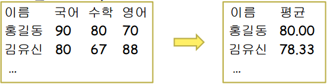

# 과제

###### 2021 1학년 2학기 문제해결과프로그래밍 과제 모음


## 과제 1
#### 문제1. 사용자로부터 화씨 온도를 받아서 섭씨 온도로 환산하여 출력하는 프로그램을 작성하시오. 섭씨 온도와 화씨 온도는 다음과 같은 수식을 만족한다.
#### C = (5/9)(F - 32)

```c
#define _CRT_SECURE_NO_WARNINGS //scanf의 보안 오류를 없애기 위해 사용한다.
#include <stdio.h> // printf, scanf함수를 사용하기 위해 사용한다.

int main() {


	float C, F; // 섭씨, 화씨 실수형 변수를 각각 C, F로 선언한다.
	printf("화씨: "); // 화씨 온도를 입력하라는 문구를 출력한다.
	scanf("%f", &F); // 화씨 온도를 실수형으로 입력받아 F 변수에 저장한다.
	C = (5.0 / 9.0)*(F - 32); // 화씨를 섭씨로 변환하여 C 변수에 저장한다.
	printf("섭씨: %f", C); // 변환한 섭씨 온도를 출력한다.

	return 0; // 프로그램을 종료한다.

}
```

#### 문제2. 사용자로부터 삼각형의 밑변의 길이와 높이를 입력받아서 삼각형의 넓이를 계산하여 출력하는 프로그램을 작성하시오.

```c
#define _CRT_SECURE_NO_WARNINGS //scanf의 보안 오류를 없애기 위해 사용한다.
#include <stdio.h> // printf, scanf함수를 사용하기 위해 사용한다.

int main() {

	float w, h; // 밑변의 길이와 높이의 길이를 저장할 실수형 변수를 선언한다.
	printf("높이: "); // 높이를 입력하라는 안내문구를 출력한다.
	scanf("%f", &h); // 높이를 입력하여 실수형 변수 h에 저장한다.
	printf("밑변: "); // 밑변을 입력하라는 안내문구를 출력한다.
	scanf("%f", &w); // 밑변을 입력하여 실수형 변수 w에 저장한다.
	printf("넓이: %f", w * h * 0.5); // 입력한 높이, 밑변을 이용하여 삼각형의 넓이 공식을 통해 넓이를 구하여 출력한다.


	return 0; // 프로그램을 종료한다.

}
```

#### 문제3. 사용자로부터 원의 반지름을 입력받아서 원의 둘레와 면적을 계산하여 출력하는 프로그램을 작성하시오.

```c
#define _CRT_SECURE_NO_WARNINGS //scanf의 보안 오류를 없애기 위해 사용한다.
#include <stdio.h> // printf, scanf함수를 사용하기 위해 사용한다.

int main() {

	float pi = 3.14; // 원주율 파이를 실수형 변수에 3.14라고 선언한다.
	float r; // 반지름을 저장할 실수형 변수 r을 선언한다.
	printf("반지름: "); // 반지름을 입력하라는 안내문구를 출력한다.
	scanf("%f", &r); // 반지름을 실수형으로 입력받은 후 실수형 변수 r에 저장한다.
	printf("둘레: %f \n면적: %f", 2 * pi * r, pi * r * r); // 입력한 반지름 r에 해당하는 원의 둘레와 면적을 계산하여 출력한다.


	return 0; // 프로그램을 종료한다.

}
```

## 과제2
#### 문제1. 태양에서 오는 빛이 몇 분 몇 초 만에 지구에 도착하는 지를 계산하여 출력하는 프로그램을 작성하시오. 빛의 속도는 1초에 30만 km를이동한다. 태양과 지구 사이의 거리는 약 1억 4960만 km이다.

```c
#include <stdio.h>

int main(void)
{
   double light_speed = 300000; // 빛의 속도 저장하는 변수
   double distance = 149600000; // 태양과 지구 사이 거리 저장하는 변수
   // 149600000km로 초기화한다.
   double time; // 시간을 나타내는 변수
   time = distance / light_speed; // 거리를 빛의 속도로 나눈다. 
   time = time / 60.0; // 초를 분으로 변환한다. 
   int time_min = time; // 위에서 구한 time에서 정수부분만 추출하여 분으로 한다.
   int time_sec = (time - time_min) * 60; // 위에서 구한 time에서 소수부분만 추출한 뒤 60을 곱하여 초로 한다.
   printf("빛의 속도는 %fkm/s \n", light_speed); // 빛의 속도를 출력한다.
   printf("태양과 지구와의 거리 %fkm \n", distance); // 태양과 지구와의 거리를 출력한다.
   printf("도달 시간은 %d분 %d초\n", time_min, time_sec); // 시간을 출력한다. 
   return 0;
}
```

#### 문제2. 사용자로부터 원의 반지름을 입력받아서 원의 둘레와 면적을계산하여 출력하는 프로그램을 작성하시오. 원주율은 기호상수로사용할 것.

```c
#define _CRT_SECURE_NO_WARNINGS //scanf의 보안 오류를 없애기 위해 사용한다.
#define Pi 3.14 // 파이값을 기호상수로 정의한다.
#include <stdio.h> // 기본적인 함수를 사용하기위해 포함한다.

int main() {

   float r; // 반지름의 값을 실수값으로 선언한다.
   printf("반지름: "); // 반지름 입력 안내문구를 출력한다.
   scanf("%f", &r); // 반지름을 실수값으로 입력하여 변수 r에 저장한다.
   printf("원의 둘레: %3.2f\n원의 면적: %3.2f", 2 * r * Pi, r * r * Pi); // 입력한 반지름 r과 기호상수 Pi를 이용해 원의 둘레와 넓이를 구하여 출력한다.

   return 0;
}
```

#### 문제3. 사용자로부터 정수를 10진수로 입력받아서 8진수, 10진수, 16진수로 출력하는 프로그램을 작성하시오. (8진수로 출력하려면 %o 사용)

```c
#define _CRT_SECURE_NO_WARNINGS //scanf의 보안 오류를 없애기 위해 사용한다.
#include <stdio.h> // 기본적인 함수를 사용하기위해 포함한다.

int main() {

   int num; // 정수형 변수 num을 선언한다.
   printf("정수를 한 개 입력하시오: "); // 정수를 입력하라는 안내문구를 출력한다.
   scanf("%d", &num); // 사용자로부터 정수값을 입력받아 num에 저장한다.
   printf("8진수: %o\n10진수: %d\n16진수: %X", num, num, num); // num에 저장한 값을 각각 8진수, 10진수, 16진수로 출력한다.

   return 0;
}

```

## 과제3
#### 문제1. 사용자로부터 4개의 정수를 입력받아서 합과 평균을 정확하게 계산하여 출력하는 프로그램을 작성하시오.

```c
#define _CRT_SECURE_NO_WARNINGS // scanf의 보안 오류를 없애기 위해 사용한다.
#include <stdio.h> // 기본적인 함수를 사용하기위해 포함한다.

int main() {

	int a, b, c, d, summ; // 4개의 정수를 입력받을 정수형 변수 a, b, c, d와 그 합을 저장할 summ을 정수형 변수로 선언한다.
	float ave; // 평균을 저장할 ave변수를 실수형으로 선언한다.
	printf("정수 4개를 사이에 공백을 두고 입력하시오.\n"); // 정수 4개를 공백을 두고 입력하라는 안내문구를 출력한다.
	scanf("%d %d %d %d", &a, &b, &c, &d); // 정수 4개를 공백을 두고 입력받아 각각 a, b, c, d에 저장한다.

	summ = a + b + c + d; // summ변수에 a + b + c + d의 값을 저장한다.
	ave = (float)summ / 4; // ave변수에 a, b, c, d의 평균을 저장한다.

	printf("합: %d\n평균: %f", summ, ave); // summ과 ave값을 출력한다.

	return 0;
}
```

#### 문제2. 1000보다 작은 정수를 입력받아서 이것을 백의 자리, 십의 자리, 일의 자리로 분리하여 출력하는 프로그램을 작성하시오. 실행 예로서 사용자가 정수 231을 입력하면 2, 3, 1을 차례로 출력하면 된다.

```c
#define _CRT_SECURE_NO_WARNINGS // scanf의 보안 오류를 없애기 위해 사용한다.
#include <stdio.h> // 기본적인 함수를 사용하기위해 포함한다.

int main() {

	int num, a, b, c, d; // 1000보다 작은 정수를 저장할 변수 num, 그리고 각 자리의 숫자를 저장할 변수 a, b, c를 정수형 변수로 선언한다.
	printf("1000보다 작은 정수를 입력하시오.\n"); // 1000보다 작은 정수를 입력하라는 안내문구를 출력한다.
	scanf("%d", &num); // 1000보다 작은 정수를 입력받는다.
	a = num / 100; // a에 백의 자리 숫자를 저장한다.
	num = num - a * 100; // 입력받은 num의 백의 자리 숫자를 제거한다.
	b = num / 10; // b에 십의 자리 숫자를 저장한다.
	num = num - b * 10; // 입력받은 num의 십의 자리 숫자를 제거한다.
	c = num; // c에 일의 자리 숫자를 저장한다.
	printf("백의 자리: %d\n십의 자리: %d\n일의 자리: %d", a, b, c); // a, b, c에 저장한 백의 자리, 십의 자리, 일의 자리 숫자를 차례대로 출력한다.

	return 0;
}
```

#### 문제3. 비트이동 연산을 이용하여 문자 4개를 받아서 하나의 unsigned int 형의 변수 안에 저장하는 프로그램을 작성하시오. 첫번째 문자는 비트 0~7, 두번째 문자는 8~15, 세번째 문자는 16~23, 네번째 문자는 24~31에 저장된다. 결과로 생성되는 정수값은 16진수로 출력한다. (비트이동연산과 비트OR연산 사용)

```c
#define _CRT_SECURE_NO_WARNINGS //scanf의 보안 오류를 없애기 위해 사용한다.
#include <stdio.h> // 기본적인 함수를 사용하기위해 포함한다.

int main() {

   int num; // 정수형 변수 num을 선언한다.
   printf("정수를 한 개 입력하시오: "); // 정수를 입력하라는 안내문구를 출력한다.
   scanf("%d", &num); // 사용자로부터 정수값을 입력받아 num에 저장한다.
   printf("8진수: %o\n10진수: %d\n16진수: %X", num, num, num); // num에 저장한 값을 각각 8진수, 10진수, 16진수로 출력한다.

   return 0;
}
```

## 과제4
#### 문제1. 실습예제의 산술 계산기에 비트 연산자(&, |, ^)을 추가하시오. (비트연산자인 경우에는 16진수로 입력값과 결과값을 출력) 아래 두가지버전으로 작성하시오.
####  if-else if-else 사용 버전.
####  switch 사용 버전

###### if-else if-else 사용 버전
```c
#define _CRT_SECURE_NO_WARNINGS // scanf의 보안 오류를 해결하기 위해 사용한다.
#include <stdio.h> // 기본적인 함수를 사용하기 위해 포함한다.

int main() {

	int a, b; // 수식의 두 항을 정수형으로 저장하기 위해 a, b를 정수형 변수로 선언한다.
	char c; // 수식의 연산자를 저장하기 위해 문자 c를 선언한다.

	printf("<if – else if – else if 사용 버전>\n수식을 입력하시오\n(예: 2 + 5)\n>>"); // 수식을 입력하라는 안내문구를 예시와 함께 출력한다.
	scanf("%d %c %d", &a, &c, &b); // 수식을 사이에 공백을 두고 입력하여 각각 a, c, b에 저장한다.

	if (c == '+') { // 만약 연산자가 + 라면
		printf("%d + %d = %d", a, b, a + b); // + 결과를 출력하고
	}
	else if (c == '-') { // 그게 아니라 연산자가 - 라면
		printf("%d - %d = %d", a, b, a - b); // - 결과를 출력하고
	}
	else if (c == '&') { // 그게 아니라 연산자가 & 라면
		printf("%d & %d = %#x", a, b, a & b); // & 결과를 16진수로 출력하고
	}
	else if (c == '|') { // 그게 아니라 연산자가 | 라면
		printf("%d | %d = %#x", a, b, a | b); // | 결과를 16진수로 출력하고
	}
	else if (c == '^') { // 그게 아니라 연산자가 ^ 라면
		printf("%d ^ %d = %#x", a, b, a ^ b); // ^ 결과를 16진수로 출력한다.
	}

	return 0;
}
```

###### switch 사용 버전
```c
#define _CRT_SECURE_NO_WARNINGS // scanf의 보안 오류를 해결하기 위해 사용한다.
#include <stdio.h> // 기본적인 함수를 사용하기 위해 포함한다.

int main() {

	int a, b; // 수식의 두 항을 정수형으로 저장하기 위해 a, b를 정수형 변수로 선언한다.
	char c; // 수식의 연산자를 저장하기 위해 문자 c를 선언한다.

	printf("<Switch 사용 버전>\n수식을 입력하시오\n(예: 2 + 5)\n>>"); // 수식을 입력하라는 안내문구를 예시와 함께 출력한다.
	scanf("%d %c %d", &a, &c, &b); // 수식을 사이에 공백을 두고 입력하여 각각 a, c, b에 저장한다.

	switch (c) { // 문자변수 c에 저장된 수식에 맞는 case가 있는 곳으로 이동한다.

	case '+': // 조건식의 값이 + 라면 실행한다.
		printf("%d + %d = %d", a, b, a + b); // + 결과를 출력하고
		break;

	case '-': // 조건식의 값이 - 라면 실행한다.
		printf("%d - %d = %d", a, b, a - b); // - 결과를 출력하고
		break;

	case '&': // 조건식의 값이 & 라면 실행한다.
		printf("%d & %d = %#x", a, b, a & b); // & 결과를 16진수로 출력하고
		break;

	case '|': // 조건식의 값이 | 라면 실행한다.
		printf("%d | %d = %#x", a, b, a | b); // | 결과를 16진수로 출력하고
		break;

	case '^': // 조건식의 값이 ^ 라면 실행한다.
		printf("%d ^ %d = %#x", a, b, a ^ b); // ^ 결과를 16진수로 출력한다.
		break;

	}

	return 0;
}
```

#### 문제2. 사용자로부터 정수 3개를 입력받아서 3개의 최대값을 구해 출력하는 프로그램을 작성하시오.

```c
#define _CRT_SECURE_NO_WARNINGS // scanf의 보안 오류를 해결하기 위해 사용한다.
#include <stdio.h> // 기본적인 함수를 사용하기 위해 포함한다.

int main() {

	int a, b, c, value; // 세 정수를 입력받아 저장할 변수 a, b, c와 가장 큰 값을 저장할 변수 value를 저장한다.

	printf("세 정수를 사이에 공백을 두고 입력하세요.\n(ex) 2 3 4\n>> "); // 세 정수를 사이에 공백을 두고 입력하라는 안내문구를 출력한다.
	scanf("%d %d %d", &a, &b, &c); // 세 정수를 공백을 사이에 두고 입력하여 각각 순서대로 a, b, c에 저장한다.

	value = a; // 가장 큰 값을 저장하는 변수인 value에 a를 저장한다.
	if (value >= b) { // 만약 b보다 더 크고
		if (value >= c) { // c보다 더 크다면 
			value = a; // 가장 큰 값은 a이다.
		}
		else { // 그게 아니라 c가 더 크다면
			value = c; // 가장 큰 값은 c이다.
		}
	}
	else { // 그게 아니라 b가 더 크다면 
		value = b; // 가장 큰 값에 b를 저장하고
		if (value >= c) { // c보다 더 크다면
			value = b; // 가장 큰 값은 b이다.
		}
		else { // 그게 아니라 c가 더 크다면
			value = c; // 가장 큰 값은 c이다.
		}
	}

	printf("가장 큰 수: %d", value); // 가장 큰 값을 출력한다.

	return 0;
}

```
#### 문제3. 사용자로부터 체중(kg)과 키(cm)를 입력받아서 표준체중을 계산한 후에 사용자의 체중과 비교하여 저체중인지, 표준인지, 과체중인지를 판단하는 프로그램을 작성하시오. 표준체중의 95~105% 사이의 체중은 표준이라고 판단한다. 표준체중은 아래식으로 계산.
#### 표준체중 = (키 - 100) * 0.9

```c
	#define _CRT_SECURE_NO_WARNINGS // scanf의 보안 오류를 해결하기 위해 사용한다.
#include <stdio.h> // 기본적인 함수를 사용하기 위해 포함한다.

int main() {

	float w, h, n_w; // 체중, 키, 표준 체중를 저장할 변수를 실수형으로 선언한다.

	printf("키와 체중 사이에 공백을 두고 순서대로 입력하세요.\n>> "); // 키와 체중을 사이에 공백을 두고 입력하라는 안내문구를 출력한다.
	scanf("%f %f", &h, &w); // 키와 체중을 순서대로 입력받아 각각 h, w에 저장한다.
	
	n_w = (h - 100) * 0.9; // 입력한 키를 바탕으로 표준 체중을 계산한다.

	if (n_w * 0.95 <= w && n_w * 1.05 >= w) { // 만약 입력한 체중이 표준체중의 95% ~ 105% 사이라면
		printf("정상(표준)체중 입니다.\n"); // 정상(표준)체중 이라는 안내문구를 출력한다.
	}
	else if (n_w * 0.95 > w) { // 만약 입력한 체중이 표준체중의 95%보다 작다면
		printf("저체중 입니다.\n"); // 저체중 이라는 안내문구를 출력한다.
	}
	else if (n_w * 1.05 < w) { // 만약 입력한 체중이 표준체중의 105%보다 크다면
		printf("과체중 입니다.\n"); // 과체중이라는 안내문구를 출력한다.
	}

	return 0;
}
```

## 과제 5
#### 문제1. 세균이 1시간마다 3배씩 증가한다고 가정하자. 이 세균 20마리를 배양하면 8시간 후의 세균의 수를 계산하여 출력하시오. 지수 함수나 로그 함수를 이용하지 말고 반복 구조만을 사용. 

```c
#include <stdio.h> // 기본적인 함수를 사용하기 위해 포함한다.

int main() {

	int germNum = 20; // 초기 세균의 수를 germNum이라는 정수형 변수에 20이라고 선언한다.

	for (int i = 0; i < 8; i++) { // for문을 이용해 8번 반복하여
		germNum = germNum * 3; // 세균의 수인 germNum을 8번 3배한다.
	}
	
	printf("%d", germNum); // 8시간이 지난 후의 세균의 수인 germNum값을 출력한다.

	return 0; // 종료한다.
}
```

#### 문제2. 종이를 한번 접으면 면적이 ½로 줄어든다. 종이를 몇 번 접어야 원래 면적의 1/50로 줄어드는지 계산하여 출력하시오. 로그 함수나 지수 함수를 사용하지 말고 반복 구조를 이용. 

```c
#include <stdio.h> // 기본적인 함수를 사용하기 위해 포함한다.

int main() {

	int paperArea = 100; // 초기 종이의 넓이를 100으로 설정한다.
	int num = 0; // 초기 접은 횟수를 0으로 설정한다.

	while (paperArea > 2) { // 종이의 넓이가 초기 종이의 넓이의 1/50이 되기 전까지 반복하여
		paperArea = paperArea * 0.5; // 초기 종이의 넓이를 2로 나눈다.
		num += 1; // 2로 나눈 횟수를 1씩 늘린다.
	}
	
	printf("%d 번", num); // while문이 끝난 후 몇 번 접었는지 출력한다.

	return 0; // 종료한다.
}

```

#### 문제3. 주사위 2개를 던졌을 때, 합이 7이 되는 경우를 전부 출력하시오. 예를 들어서 (1, 6), (2, 5),...와 같이 출력되면 된다. 또 주사위 3개를 사용하여서 합이 12이 되는 경우를 전부 출력하시오. 

```c
#include <stdio.h> // 기본적인 함수를 사용하기 위해 포함한다.

int main() {

	printf("주사위의 두 숫자를 더해서 7이 되는 경우\n"); // 주사우의 두 숫자를 더해서 7이 되는 경우를 출력한다는 안내문구를 출력한다.

	for (int i = 1; i < 7; i++) { // 주사위의 눈 개수만큼 ㅑ를 1부터 6까지 1씩 키운다.
		for (int j = 1; j < 7; j++) { // 주사위의 눈 개수만큼 j를 1부터 6까지 1씩 키운다.
			if (i + j == 7) { // 만약 i와 j를 더했을 때 7이라면,
				printf("\(%d, %d\) ", i, j); // 그 순서쌍을 출력한다.
			}
		}
	}

	printf("\n\n"); // 줄간격 확보

	printf("주사위의 세 숫자를 더해서 12가 되는 경우\n"); // 주사우의 세 숫자를 더해서 12가 되는 경우를 출력한다는 안내문구를 출력한다.

	for (int i = 1; i < 7; i++) { // 주사위의 눈 개수만큼 ㅑ를 1부터 6까지 1씩 키운다.
		for (int j = 1; j < 7; j++) { // 주사위의 눈 개수만큼 j를 1부터 6까지 1씩 키운다.
			for (int k = 1; k < 7; k++) { // 주사위의 눈 개수만큼 k를 1부터 6까지 1씩 키운다.
				if (i + j + k == 12) { // i, j, k를 더했을 때 12라면
					printf("\(%d, %d, %d\) ", i, j, k); // 그 순서쌍을 출력한다.
				}
			}
		}
	}

	return 0; // 종료한다.
}
```

## 과제6
#### 문제1. 삼각형의 밑변의 길이와 높이를 받아서 삼각형의 넓이를 계산하는 함수(매개변수 : 밑변길이, 높이, 반환값: 넓이)를 작성하고, 이 함수를 이용하여 삼각형의 넓이를 출력하는 프로그램을 작성하시오. (main() 함수에서 삼각형의 밑변의 길이와 높이를 사용자로부터 입력받도록 하시오.)

```c
#define _CRT_SECURE_NO_WARNINGS // scanf의 보안 오류를 무시하기 위해 선언한다.
#include <stdio.h> // 기본적인 함수를 사용하기 위해 포함한다.

float Area(float w, float h) { // 밑변의 길이와 높이를 실수형 매개변수로 가지는 함수를 실수형으로 선언한다.

	return w * h * 0.5; // 매개변수의 값을 삼각형의 넓이 공식을 이용하여 계산한 후 반환한다.
}

int main() {

	float W, H; // 밑변의 길이와 높이를 저장할 실수형 변수 W와 H를 선언한다.

	printf("밑변의 길이와 높이를 사이에 공백을 두고 순서대로 입력하시오.\n"); // 밑변의 길이와 높이를 사이에 공백을 두고 순서대로 입력하라는 안내문구를 출력한다.
	scanf("%f %f", &W, &H); // 밑변의 길이와 높이를 사이에 공백을 두고 순서대로 W와 H에 저장한다.

	printf("넓이: %3.2f", Area(W, H)); // Area함수를 이용하여 삼각형의 넓이를 계산한 뒤 소숫점 3째자리에서 반올림하여 출력한다.

	return 0; // 프로그램을 종료한다.
}
```

#### 문제2. -1~1 사이의 임의의 실수를 생성하는 함수를 작성하고 이 함수를 이용하여 10개의 실수를 생성하여 출력하시오. (rand() 함수 사용; 실행할 때 마다 다른 실수값 생성할 것)

```c
#include <stdio.h> // 기본적인 함수를 사용하기 위해 포함한다.
#include <time.h> // sarnd의 seed를 시간으로 설정하여 매번 다른 난수를 생성하기 위해 포함한다.

double max = 32767; // 난수의 최대값을 설정한다.

float randomFloat() { // -1~1 사이의 난수를 생성하는 함수이다.
	
	float num = 1.0 - rand() / (0.5 * max); // 최대값의 절반으로 나누어 0~2 사이의 실수 난수를 생성한 뒤 1에서 난수값을 빼서 -1 ~ 1 사이의 실수 난수를 생성한다.

	return num; // 위에서 생성한 난수를 반환한다.
}

int main() {

	srand(time(NULL)); // 랜덤함수의 seed를 현재시간으로 설정한다.

	for (int i = 0; i < 10; i++) { // 10회 반복한다.
		printf("%f\n", randomFloat()); // randomFloat함수를 사용해 -1 ~ 1사이의 실수 난수를 출력한다.
	}

	return 0; // 프로그램을 종료한다.

}
```

#### 문제3. 1부터 n까지의 양의 정수의 합을 계산하여 반환하는 함수를 1)반복문, 2)순환기법을 이용하여 작성하고 이 함수들을 이용하여 양의 정수 N까지의 합을 출력하는 프로그램을 작성하시오. N값은 사용자로부터 입력받음.

```c
#define _CRT_SECURE_NO_WARNINGS // sacnf의 보안 오류를 무시하기 위해 정의한다.
#include <stdio.h> // 기본적인 함수를 사용하기 위해 포함한다.

int cycle(int num) { // 재귀함수를 이용하여 num까지의 정수의 합을 구한다.

	if (num == 1) { // 만일 n이 1이라면
		return num; // num값을 반환하고
	}
	else { // 그게 아니라면
		return num + cycle(num - 1); // cycle함수를 다시 호출하여 num값에 cycle(num-1)을 더해준 뒤 그 값을 반환한다.
	}
}

int main() {

	int n; // 사용자가 입력할 정수 n을 저장할 변수를 정수형으로 선언한다.
	int result = 0; // 반복문을 이용해 결과값을 저장할 변수 result를 정수형으로 선언한다.

	printf("정수 N을 입력하시오.\n>> "); // 정수 N을 입력하라는 안내문구를 출력한다.
	scanf("%d", &n); // 정수 N의 값을 입력하여 변수 n에 저장한다.

	for (int i = 1; i <= n; i++) { // for문을 이용하여 1부터 n까지 정수의 합을
		result = result + i; // result변수에 저장한다.
	}

	printf("반복문을 이용한 출력값: %d\n", result); // 반복문을 이용한 정수의 합을 출력한다.
	printf("순환기법을 이용한 출력값: %d", cycle(n)); // 재귀함수를 이용한 정수의 합을 출력한다.

	return 0; // 프로그램을 종료한다.

}
```

## 과제7
#### 문제1. 1차원 배열의 원소 중에서 최대값을 찾아 반환하는 함수(입력: 정수형 배열, 배열의 크기)를 작성하시오. 이 함수를 이용하여 20개의원소를 갖는 정수형 배열에서 최대값을 찾아 출력하시오. 정수형 배열은 구간 [-50, 50]사이의 임의의 정수값들을 갖도록 한다. 

```c
#include <stdio.h> // 기본적인 함수를 사용하기 위해 포함한다.
#include <stdlib.h> // 기본적인 함수를 사용하기 위해 포함한다.
#include <time.h> // time(NULL)을 사용하여 난수 생성을 하기 위해 포함한다.

int maxNum(int N[20], int size); // 배열에서 최대값을 찾아 반환하는 함수를 선언한다.

int main() {
   
   srand(time(NULL)); // seed를 time(NULL)로 설정한다.
   
   int N[20]; // 정수 20개를 저장할 배열을 선언한다.

   for (int i = 0; i < 20; i++) { // 배열의 크기인 20만큼 반복하여
      N[i] = 50 - (rand() % 100); // -50 ~ 50의 난수를 저장한다.
   }
   
   printf("\n\n최대값: %d", maxNum(N, 20)); // 생성한 난수 리스트를 maxNum함수를 이용하여 최대값을 출력한다.

   return 0; // 프로그램을 종료한다.
}

int maxNum(int N[20], int size) { // 최대값을 찾는 함수이다.

   int value = N[0]; // 전달받은 리스트의 맨 처음 값을 value에 저장한다.

   for (int i = 0; i < size; i++) { // 배열의 크기만큼 반복하여
      if (value <= N[i]) { // 만약 value보다 N[i]가 크다면
         value = N[i]; // value에 N[i]를 저장한다.
      }
   }

   return value; // value 값을 반환한다.
}
```

#### 문제2. n차원 벡터 a, b를 실수형 배열로 입력받아서 두 벡터의 내적(inner product)을 계산하여 반환하는 함수(입력 : 두 실수형 배열 a[], b[], 배열의 크기 n)를 작성하고 이 함수를 이용하여 내적계산을 테스트하시오. (예: 2차원 벡터 a=(a1,a2), b=(b1,b2)의 내적은a1*b1+a2*b2 임)

```c
#define _CRT_SECURE_NO_WARNINGS // scanf의 오류를 무시하기 위해 정의한다.
#define size 50 // 배열의 최대 크기를 정의한다.

#include <stdio.h> // 기본적인 함수를 사용하기 위해 포함한다.
#include <stdlib.h> // 기본적인 함수를 사용하기 위해 포함한다.

float ip(float *A, float *B, int s); // inner products 기능을 하는 함수를 정의한다. 

int main() {

   float a[size] = { 0 }; // 실수형 배열 a의 모든 값을 0으로 초기화한다.
   float b[size] = { 0 }; // 실수형 배열 b의 모든 값을 0으로 초기화한다.

   int n; // 차원을 저장할 정수형 변수 n을 선언한다.

   printf("n차원 입력\n>>"); // 차원 n을 입력하라는 안내문구를 출력한다.
   scanf("%d", &n); // 입력한 차원을 정수형 변수 n에 저장한다.

   for (int i = 0; i < n; i++) { // n 만큼 반복하여
      printf("a[%d] = ", i); // a벡터의 성분을
      scanf("%f", &a[i]); // 실수형으로 입력한다.
   }

   for (int i = 0; i < n; i++) { // n 만큼 반복하여
      printf("b[%d] = ", i); // b벡터의 성분을
      scanf("%f", &b[i]); // 실수형으로 입력한다.
   }

   printf("\n\n내적: %f", ip(a, b, n)); // ip함수를 사용하여 내적 값을 출력한다.

   return 0; // 프로그램을 종료한다.

}

float ip(float *A, float *B, int s) { // 내적 값을 반환하는 함수를 선언한다.

   float value = 0; // 반환할 값을 저장할 변수 value를 선언한다.

   for (int i = 0; i < s; i++) { // s만큼 반복하여
      value = value + (A[i] * B[i]); // 내적 값을 계산한 뒤
   }

   return value; // 최종 값을 반환한다.
}
```

#### 문제3. Tic-tac-toe 프로그램에서 보드를 분석하여서 게임이 종료되었는지를 검사하는 함수를 추가하시오.

```c
#define _CRT_SECURE_NO_WARNINGS

#include <stdio.h>
#include <stdlib.h>

void init_board(char board[3][3]);
void disp_board(char board[3][3]);
int check_winner(char board[3][3], int num); // tic-tac-toe의 승패를 결정짓는 함수를 선언한다.

int main(void)
{
   char board[3][3], player;
   int k, x, y;
   init_board(board);
   for (k = 0; k < 9; k++) {
      player = (k % 2 == 0) ? 'X' : 'O';
      while (1) {
         printf("player % c -> (x, y) 좌표 : ", player);
         scanf("%d %d", &x, &y);
         if (board[x][y] == ' ') break; // 비어있는 좌표 입력
         else printf("에러 : 이미 입력된 좌표 !!\n");
      }
      board[x][y] = player;
      disp_board(board);
      if (check_winner(board, k) == 1) { // check_winner의 반환값이 1이라면
         break; // 게임을 중지한다.
      }
   }
   return 0;
}

void init_board(char board[3][3])
{
   int x, y;
   for (x = 0; x < 3; x++)
      for (y = 0; y < 3; y++) board[x][y] = ' '; // space character
}
void disp_board(char board[3][3])
{
   int i;
   for (i = 0; i < 3; i++) {
      printf("---|---|---\n");
      printf(" %c | %c | %c \n", board[i][0], board[i][1], board[i][2]);
   }
   printf("---|---|---\n");
}

int check_winner(char board[3][3], int num) {

   for (int i = 0; i < 3; i++) { // 3회 반복하여

      if (board[i][0] == board[i][1] && board[i][1] == board[i][2] && board[i][0] != ' ' && board[i][1] != ' ' && board[i][2] != ' ') { // 세로로 빈 칸이 아닌 같은 종류의 말이 놓여있다면
         printf("winner: player %c", (num % 2 == 0) ? 'X' : 'O'); // 해당 말의 플레이어의 승리 문구를 출력하고
         return 1; // 1을 반환한다.
      }
      else if (board[0][i] == board[1][i] && board[1][i] == board[2][i] && board[0][i] != ' ' && board[1][i] != ' ' && board[2][i] != ' ') { // 가로로 빈 칸이 아닌 같은 종류의 말이 놓여있다면
         printf("winner: player %c", (num % 2 == 0) ? 'X' : 'O'); // 해당 말의 플레이어의 승리 문구를 출력하고
         return 1; // 1을 반환한다.
      }
   }

   if (board[0][0] == board[1][1] && board[1][1] == board[2][2] && board[0][0] != ' ' && board[1][1] != ' ' && board[2][2] != ' ') { // 대각선으로 빈 칸이 아닌 같은 종류의 말이 놓여있다면
      printf("winner: player %c", (num % 2 == 0) ? 'X' : 'O'); // 해당 말의 플레이어의 승리 문구를 출력하고
      return 1; // 1을 반환한다.
   }
   else if (board[0][2] == board[1][1] && board[1][1] == board[2][0] && board[0][2] != ' ' && board[1][1] != ' ' && board[2][0] != ' ') { // 대각선으로 빈 칸이 아닌 같은 종류의 말이 놓여있다면
      printf("winner: player %c", (num % 2 == 0) ? 'X' : 'O'); // 해당 말의 플레이어의 승리 문구를 출력하고
      return 1; // 1을 반환한다.
   }

   return 2; // 그 무엇도 해당되지 않는다면 2를 반환한다.
}
```

## 과제8
#### 문제1. 두개의 양의 정수를 입력받아 최소공배수와 최대공약수를 반환하는 함수를 작성하고 테스트하시오.

```c
#define _CRT_SECURE_NO_WARNINGS // scanf의 보안 오류를 무시하기 위해 define
#include <stdio.h> // 기본적인 함수를 사용하기 위해 include

void GCM_GCF(int a, int b, int* GCM, int* GCF); // 입력한 두 수, 최대공약수를 저장할 변수와 연결된 포인터, 최소공배수를 저장할 변수와 연결된 포인터를 매개변수로 한 함수를 정의한다.
void swap(int* px, int* py); // 유클리드 호제 방법을 사용하기 위해 swap 함수를 정의한다.

int main() {

	int multiple, factor; // 최소공배수, 최대공약수를 저장할 multiple, factor를 정수형 변수로 선언한다.
	int num_1, num_2; // 두 수를 저장할 변수를 정수형 변수로 선언한다.

	printf("두 양의 정수를 사이에 공백을 두고 입력하시오.\n>> "); // 두 수를 사이에 공백을 두고 입력하라는 안내문구를 출력한다.
	scanf("%d %d", &num_1, &num_2); // 입력한 두 수를 num_1, num_2에 각각 저장한다.

	if (num_1 < num_2) { // 유클리드 호제 방법을 사용하기 전에 앞의 수가 더 작다면
		swap(&num_1, &num_2); // swap함수를 이용하여 교체한다.
	}

	GCM_GCF(num_1, num_2, &multiple, &factor); // 최대공약수, 최소공배수를 구하는 함수를 이용하여 multiple, factor의 변수에 직접 저장한다.

	printf("최대공약수: %d\n최소공배수: %d\n", factor, multiple); // 변수에 저장된 최대공약소, 최소공배수를 출력한다.

}

void GCM_GCF(int a, int b, int* GCM, int* GCF) {

	int c; // 유클리드 호제 방법에 필요한 변수 c를 선언한다.
	int d = a; // 유클리드 호제 방법을 사용하면서 값이 변하기 때문에 미리 다른 변수에 a, b의 값을 복사해둔다.
	int e = b; // 유클리드 호제 방법을 사용하면서 값이 변하기 때문에 미리 다른 변수에 a, b의 값을 복사해둔다.

	while (e != 0) // 유클리드 호제 방법
	{
		c = d % e;
		d = e;
		e = c;
	}
	
	*GCF = d; // 유클리드 호제 방법으로 구한 최대공약수를 최대공약수 변수에 직접 저장한다.
	*GCM = (a * b) / *GCF; // 위에서 구한 최대공약수를 이용하여 최소공배수를 변수에 직접 저장한다.

}

void swap(int* px, int* py) // swap
{
	int tmp; // 교환에 필요한 변수를 선언한다.

	tmp = *px; // tmp에 *px에 연결된 변수를 저장한다.
	*px = *py; // *px에 연결된 변수에 *py에 연결된 변수를 저장한다.
	*py = tmp; // *py에 연결된 변수에 tmp를 저장한다.

}
```

#### 문제2. n개의 원소를 갖는 실수형 배열을 입력받아 평균과 표준편차를 계산하여 반환하는 함수를 작성하고 테스트하시오.

```c
	#define size 25 // 배열의 크기를 25로 define

#include <stdio.h> // 기본적인 함수를 사용하기 위해 include
#include <math.h> // 표준편차를 계산하기 위해 include

void ave_sd(float* num, int* ave, int* sd); // 평균과 표준편차를 구하는 함수의 매개변수를 num배열, 평균, 표준편차 변수와 연결되는 포인터로 하여 선언한다.

int main() {

	srand(time(NULL)); // random함수의 seed를 현재시간으로 설정한다.

	float num[size] = { 0.0 }; // 실수형 배열을 0으로 초기화하여 선언한다.
	
	float ave, sd; // 평균과 표준편차를 저장할 변수를 선언한다.

	for (int i = 0; i < size; i++) { // 배열의 크기만큼 반복하여
		num[i] = (float)(rand() % 25500)/100.0; // num 배열에 0 ~ 255.00 사이의 실수난수를 저장한다.
	}

	for (int i = 0; i < size; i++) { // 배열의 크기만큼 반복하여
		printf("num[%d] = %.2f\n", i, num[i]); // 배열에 저장된 원소를 출력한다.
	}

	ave_sd(&num, &ave, &sd); // ave_sd 함수를 이용하여 평균과 표준편차를 저장한다.

	printf("평균: %.2f\n표준편차: %.2f", ave, sd); // 평균과 표준편차를 출력한다.

	return 0; // 프로그램을 종료한다.

}

void ave_sd(float* num, float* ave, float* sd) { // 평균과 표준편차를 구하는 함수의 매개변수를 num배열, 평균, 표준편차 변수와 연결되는 포인터로 하여 선언한다.

	float all = 0; // 변량의 총 합을 저장할 변수 all을 실수형으로 선언한다.
	float deviation = 0; // 편차 제곱의 총 합을 저장할 변수 deviation을 실수형으로 선언한다.

	for (int i = 0; i < size; i++) { // 배열의 크기만큼 반복하여
		all += *(num + i); // 변량의 총 합을 all에 저장한다.
	}

	*ave = all / size; // 평균값을 저장하는 변수와 연결된 포인터에 평균값을 저장한다.

	for (int i = 0; i < size; i++) { // 배열의 크기만큼 반복하여
		deviation += (*(num + i) - *ave) * (*(num + i) - *ave); // 편차 제곱의 총 합을 deviation에 저장한다.
	}

	*sd = sqrt(deviation / size); // 표준편차를 저장하는 변수와 연결된 포인터에 평균값을 저장한다.

}
```

#### 문제3. n개의 원소를 갖는 정수형 배열을 입력받아 역순으로 재배치하는 함수를 작성하고 테스트하시오. (역순으로 된 배열은 입력배열에 overwrite 하시오)

```c
#define _CRT_SECURE_NO_WARNINGS // scsanf의 보안 오류를 무시하기 위해 define
#define size 10 // 배열의 크기를 지정하기 위해 define

#include <stdio.h> // 기본적인 함수를 사용하기 위해 include

void reverse(int* a[]); // 정수를 입력한 배열을 매개변수로 하는 함수 선언

int main() {

	int num[size] = { 0 }; // size의 크기를 가진 정수형 배열 선언

	printf("%d개의 정수를 입력하시오.\n", size); // size만큼 정수를 입력하라는 안내문구 출력

	for (int i = 0; i < size; i++) { // size만큼 반복하여
		printf(">> num[%d] = ", i); // 몇 번째 정수인지 출력하고
		scanf("%d", &num[i]); // 정수를 입력하여 num[i]에 저장
	}

	reverse(num); // reverse함수로 배열 순서 뒤집기

	printf("\n\nreverse\n\n"); // 뒤집은 배열 출력 안내문구

	for (int i = 0; i < size; i++) { // size만큼 반복하여
		printf(">> num[%d] = %d\n", i, num[i]); // num 배열에 저장된 정수 순서대로 출력
	}

}

void reverse(int* a[]) { // 맨 뒤와 맨 앞의 원소를 바꾸면서 순서를 뒤집는 함수이다.

	int tmp; // 배열의 순서를 바꿀 때 필요한 변수 선언

	for (int i = 0; i < size / 2; i++) { // 배열 크기의 절반만큼 반복하여
		
		tmp = *(a + i); // 맨 앞의 원소를 tmp에 저장하고
		*(a + i) = *(a + size - i - 1); // 맨 뒤의 원소를 맨 앞의 원소에 저장하고
		*(a + size - i - 1) = tmp; // 맨 뒤의 원소에 맨 앞의 원소를 저장한다
	}

}
```

## 과제9
#### 문제1. 다음과 같이 연산의 이름을 문자열로 받아서 해당 연산을 실행하는 프로그램을 작성하시오. (연산 이름 : add, sub, mul, div)
#### 실행 예:
#### 연산을 입력하시오: add 3.2 5.1
#### 연산의 결과: 8.3

```c
#define _CRT_SECURE_NO_WARNINGS // scanf의 오류를 무시하기 위해 define
#include <stdio.h> // 기본적인 함수를 사용하기 위해 include

int main() {

	char sign[4] = ""; // 연산 기호를 저장하기 위한 문자열 변수 sign 선언
	float num_1, num_2; // 연산 숫자를 저장하기 위한 실수형 변수 num_1, num_2 선언

	printf("add, sub, mul, div 중 한가지를 사용하여 식을 입력하시오.\nex) add 3.2 5.1\n>>");  // 수식 입력 안내 문구 출력
	scanf("%s %f %f", &sign, &num_1, &num_2); // 입력한 수식을 sign, num_1, num_2에 저장

	if (strcmp(sign, "add") == 0) { // 만약 add 라면
		printf("add: %f\n", num_1 + num_2); // 더한 결과값을 출력
	}
	else if (strcmp(sign, "sub") == 0) { // 만약 sub 이라면
		printf("sub: %f\n", num_1 - num_2); // 뺀 결과값을 출력
	}
	else if (strcmp(sign, "mul") == 0) { // 만약 mul 이라면
		printf("mul: %f\n", num_1 * num_2); // 곱한 결과값을 출력
	}
	else if (strcmp(sign, "div") == 0 && num_2 != 0) { // 만약 div이고 나누는 값이 0이 아니라면
		printf("div: %f\n", num_1 / num_2); // 나눈 결과값을 출력
	}
	else if (strcmp(sign, "div") == 0 && num_2 == 0) { // 만약 div이고 나누는 값이 0이라면
		printf("0으로 나눌 수 없습니다.\n"); // 나눌 수 없다는 안내문구를 출력
	}

	return 0;

}
```

#### 문제2. 메시지 안호화 실습 예제를 아래 사항을 추가하여 보완하시오.
#### 복호화 하는 함수 decrypt()도 추가
#### 무한루프 안에 메뉴를 만들어서 사용자로 하여금 암호화, 복호화, 종료 중에서 선택 (1 - 암호화, 2 - 복호화, 3 - 종료)

```c
#define _CRT_SECURE_NO_WARNINGS // scanf의 보안 오류를 무시하기 위해 define
#include <stdio.h> // 기본적인 함수를 사용하기 위해 include

void encrypt(char cipher[], int shift); // 암호화 함수 정의
void decrypt(char cipher[], int shift); // 복호화 함수 정의

int main(void)
{

	char cipher[50]; // 암호문, 복호문, 원문을 저장할 문자열 선언
	int shift = 3; // 암호 키를 3으로 선언
	int num; // 작업 번호를 저장할 변수 선언

	while (1) { // 값이 참이라면 계속 반복

		printf("원하는 작업을 선택하시오.\n\n1. 암호화\n2. 복호화\n3. 종료\n\n"); // 원하는 작업을 선택하라는 안내문구 출력
		scanf("%d%*c", &num); // 1, 2, 3 중 한가지를 선택하여 num에 저장

		if (num == 1) { // 만약 암호화를 선택했다면

			printf("문자열을 입력하시오: "); // 암호화 할 문자열을 입력하라는 안내문구 출력
			gets_s(cipher, 50); // gets_s를 사용하여 한 문장의 문자열 입력
			encrypt(cipher, shift); // 암호화 함수를 사용하여 암호키만큼 옮겨 암호화 후 암호문 출력
			num = 0; // 작업 번호를 0으로 초기화

		}
		else if(num == 2) { // 만약 복호화를 선택했다면
			
			printf("문자열을 입력하시오: "); // 복호화 할 문자열을 입력하라는 안내문구 출력
			gets_s(cipher, 50); // gets_s를 사용하여 한 문장의 문자열 입력
			decrypt(cipher, shift); // 복호화 함수를 사용하여 암호키만큼 옮겨 복호화 후 원문 출력
			num = 0; // 작업 번호를 0으로 초기화

		} else if(num == 3) { // 만약 종료를 선택했다면

			break; // 반복문을 탈출한다.
		}
	}

	return 0;

}

void encrypt(char cipher[], int shift)
{
	int i = 0; // i를 0으로 선언
	while (cipher[i] != '\0') { // 저장된 문자가 없을 때 까지 반복
		if (cipher[i] >= 'a' && cipher[i] <= 'z') { // 만약 a~z 사이라면
			cipher[i] += shift; // 암호키 만큼 이동
			if (cipher[i] > 'z') // 이동 후 z보다 크다면
				cipher[i] -= 26; // 26만큼 빼서 저장
		}
		i++; // 다음 문자로 이동하기 위해 i 값을 1씩 증가
	}
	printf("암호화된 문자열: %s\n", cipher); // 반복문이 끝나면 암호문 출력
}

void decrypt(char cipher[], int shift) {

	int i = 0; // i를 0으로 선언
	while (cipher[i] != '\0') { // 저장된 문자가 없을 때 까지 반복
		if (cipher[i] >= 'a' && cipher[i] <= 'z') { // 만약 a~z 사이라면
			cipher[i] -= shift; // 암호키 만큼 반대로 이동
			if (cipher[i] < 'a') // 이동 후 a보다 작다면
				cipher[i] += 26; // 26만큼 더해서 저장
		}
		i++; // 다음 문자로 이동하기 위해 i값을 1씩 증가
	}
	printf("복호화된 문자열: %s\n", cipher); // 반복문이 끝나면 복호문 출력

}
```

#### 문제3. 행맨게임 실습 예제를 아래 사항을 추가하여 보완하시오.
#### 여러 개의 단어들이 들어 있는 2차원 배열을 생성하여서 랜덤하게 하나의 정답을 고르도록 함
#### 정답과 같은 패턴의 밑줄을 자동으로 생성하여 표시하게 함
####  ex) meet at midnight => ____ __ ________
#### 일정한 횟수만 시도 가능하게 함(가능한 최대 횟수 초과시 메세지 출력)
#### 정답을 맞추었을 때 "성공"이라는 메시지 출력

```c
#define _CRT_SECURE_NO_WARNINGS // 보안 오류를 무시하기 위해 define
#define chance 20 // 횟수를 정의한다.
#define SIZE 5 // 정답의 개수를 정의한다.

#include <stdio.h> // 기본적인 함수를 사용하기 위해 include 
#include <string.h> // 문자열과 관련된 함수를 사용하기 위해 include 
#include <time.h> // 난수를 생성할 때 시드값을 설정하기 위해 include

int check(char s[], char a[], char ch); // 정답 비교를 위한 함수 정의

int main(void)
{

	srand(time(NULL)); // 랜덤 시드 설정

	char solution[SIZE][100] = { // 답 배열 저장
		{"meet at midnight"},
		{"this is koreatech"},
		{"nice to meet you"},
		{"computer science"},
		{"this is hang man"}
	};

	char answer[5][100]; // 답 글자 수 저장을 위한 배열 선언

	for (int i = 0; i < SIZE; i++) { // 정답의 개수만큼 반복하여
		char ans[100]; // 임시로 정답을 저장할 배열 선언
		strcpy(ans, solution[i]); // solution[i]에 저장되어있는 정답을 ans에 복사
		for (int j = 0; j < strlen(ans); j++) { // ans의 길이만큼 반복하여
			if (ans[j] != ' ') { // 공백이 아닌 문자가 있다면
				ans[j] = '_'; // 그 문자를 밑줄로 변경
			}
		}
		strcpy(answer[i], ans); // 밑줄로 전부 변경된 ans문자열을 answer[i]에 복사
	}

	char ch; // 추측한 글자 저장을 위해 선언

	int num = rand() % 5; // 답 중에서 랜덤으로 뽑기 위해 1~5 중 하나의 난수 생성
	int i = 1; // 기회를 세기 위해 i 를 1로 설정

	printf("기회: 총 %d번\n", chance); // 총 기회가 몇 번인지 출력

	while (i <= chance) { // 기회를 전부 소모하기 전까지 반복

		printf("\n%d번째\n", i); // 몇 번째 기회인지 출력
		printf("입력된 문자열 : %s \n", answer[num]); // 추측한 글자가 맞는지 출력
		printf("글자를 추측하시오: "); // 추측한 글자 입력안내 문구 출력

		ch = getchar(); // 추측한 글자를 ch에 저장

		if (check(solution[num], answer[num], ch) == 1) { // check함수에 매개변수로 전달하여 만약 리턴값이 1이라면
			printf("성공\n정답: %s\n", solution[num]); // 성공이라는 문구와 함께 정답 공개
			break; // 반복문 탈출
		}

		i++; // 횟수 증가

		// fflush(stdin); // 줄바꿈 문자 제거, VS2015부터 안됨.
		getchar(); // 줄바꿈 문자 제거 올바른 방법

	}

	if (i > chance) { // 만약 모든 기회를 소진했다면
		printf("실패\n정답: %s\n", solution[num]); // 실패라는 문구와 함께 정답 공개
	}

	return 0; // 프로그램 종료
}

int check(char s[], char a[], char ch)
{

	int i;

	for (i = 0; s[i] != NULL; i++) { // 정답과 추측 글자를 비교하여

		if (s[i] == ch) { // 만약 같은것이 있다면
			a[i] = ch; // 추측 문자열에 추측 글자로 바꾸어서 저장
		}

	}

	if (strcmp(s, a) == 0) { // 만약 전부 일치한다면
		return 1; // 1 반환

	}// 정답과 일치하는지를 검사
	else // 그게 아니라면
	{

		return 0; // 0 반환

	}

}
```

## 과제 10
#### 문제1. 구조체 강의자료의 실습:벡터연산 소스에서 함수 get_vector_sum()를 vector 구조체에 대한 포인터를 사용하여 바꾸고 테스트하시오.

```c
#include <stdio.h> // 기본적인 함수를 사용하기 위해 include

struct vector { // x, y좌표를 멤버로 하는 구조체 vector 선언

	float x;
	float y;

};

int main(void)
{

	struct vector a = { 2.0, 3.0 }; // a 구조체 변수의 멤버가 각각 2.0, 3.0으로 선언
	struct vector b = { 5.0, 6.0 }; // b 구조체 변수의 멤버가 각각 5.0, 6.0으로 선언

	struct vector *p1; // 구조체 포인터 변수 p1 선언
	struct vector *p2; // 구조체 포인터 변수 p2 선언

	p1 = &a; // 구조체 포인터 변수 p1과 구조체 변수 a의 주소를 연결
	p2 = &b; // 구조체 포인터 변수 p2와 구조체 변수 b의 주소를 연결

	struct vector sum = { (*p1).x + (*p2).x, (*p1).y + (*p2).y }; // 구조체 변수 sum의 멤버를 각각 구조체 포인터 변수에 연결된 구조체 변수들의 각 x값과 y값의 합으로 선언

	printf("벡터의 합은 (%f, %f)입니다.\n", sum.x, sum.y); // 구조체 변수 sum의 x와 y값 출력

	return 0; // 프로그램 종료
}
```

#### 문제2. 2차원 배열의 특정한 열의 원소들의 평균을 구하는 함수를 작성하고 테스트하시오.

```c
#define SIZE 5 // 2차원 배열의 크기를 define

#include <stdio.h> // 기본적인 함수를 사용하기 위해 include
#include <stdlib.h> // random함수를 사용하기 위해 include
#include <time.h> // random함수의 seed를 설정하기 위해 include

float list_ave(int* num_list); // 평균을 반환하는 함수 선언

int main() {

	srand(time(NULL)); // seed를 time(NULL)로 설정

	int num_list[SIZE][SIZE] = { 0 }; // 2차원 배열 초기화
	int row = rand() % SIZE; // 열 랜덤하게 생성

	for (int i = 0; i < SIZE; i++) { // 2중 for문을 이용해서
		for (int j = 0; j < SIZE; j++) {
			num_list[j][i] = rand() % 100; // num_list에 난수 저장한다. 이때 행과 열을 바꾸어 저장한다.
		}
	}

	for (int i = 0; i < SIZE; i++) { // 2중 for문을 이용해서
		printf("%d 열 >> ", i);
		for (int j = 0; j < SIZE; j++) {
			printf("%d ", num_list[i][j]); // num_list에 저장된 난수값들 출력
		}
		printf("\n");
	}

	printf("%d열의 평균: %f", row, list_ave(num_list[row])); // 해당 row의 평균값 출력

	return 0;
}

float list_ave(int* num_list) { // 평균을 구하는 함수 정의

	float ave = 0; // 평균값 0으로 초기화

	for (int i = 0; i < SIZE; i++) { // 포인터로 전달받은 배열의 총 합 구하고
		ave = *(num_list + i) + ave;
	}

	ave = ave / SIZE; // 배열의 총 개수로 나눠서 평균 저장

	return ave; // 평균 반환
}
```

#### 문제3. int형 배열과 int형 포인터를 받아서 포인터가 배열의 가장 작은 값을 가리키게 하는 함수 set_min_ptr()을 구현하고 테스트하시오. 함수 원형 : void set_min_ptr(int m[], int size, int **pmin);

```c
#define SIZE 50 // 배열의 크기 define

#include <stdio.h> // 기본적인 함수를 사용하기 위해 include
#include <stdlib.h> // random 함수를 사용하기 위해  include
#include <time.h> // random 함수의 seed를 설정하기 위해 include

void set_min_ptr(int m[], int size, int** pmin); // 포인터가 배열의 가장 작은 값을 가리키게 하는 함수 선언

int main() {

	srand(time(NULL)); // seed를 time(NULL)로 설정

	int num[SIZE] = { 0 }; // 정수형 배열 초기화
	int *p; // 정수형 포인터 선언

	p = num[0]; // 포인터와 배열의 맨 첫 번째 값 연결

	for (int i = 0; i < SIZE; i++) { // 배열의 크기만큼 반복하여
		num[i] = rand() % 255; // 난수 저장
	}

	set_min_ptr(num, SIZE, &p); // 포인터가 배열의 가장 작은 값을 가리키도록하는 함수 호출

	for (int i = 0; i < SIZE; i++) { // 배열의 크기만큼 반복하여
		printf("num[%d] = %d\n", i, num[i]); // 배열의 값 출력
	}

	printf("최소값: %d", *p); // 포인터와 연결된 변수의 값 출력

	return 0;

}

void set_min_ptr(int m[], int size, int** pmin) { // 포인터가 배열의 가장 작은 값과 연결되도록 하는 함수 정의

	int min = m[0]; // 최소값을 전달받은 배열의 맨 앞 원소로 선언

	for (int i = 0; i < SIZE; i++) { // 배열의 크기만큼 반복하여
		if (min >= m[i]) { // 만약 min이 배열의 원소보다 크다면
			*pmin = &m[i]; // 포인터의 위치를 배열의 현재 원소와 연결하고
			min = m[i]; // min에 배열의 현재 원소를 저장한다.
		}
	}

}

```

#### 문제4. main() 함수의 인수로 달러금액과 환율(원/달러)을 입력받아서 원화금액을 계산하는 프로그램을 작성하시오. (적절한 개수의 인수가 입력되지 않으면 “사용법”을 화면에 표시)

```c
#include <stdio.h> // 기본적인 함수를 사용하기 위해 include
#include <stdlib.h> // atoi를 사용하기 위해 include 

int main(int argc, char* argv[]) { // 인수를 입력받는 상태의 main함수

	if (argc < 3) { // 만약 입력한 인수가 3개 미만이라면
		printf("입력한 인수가 부족합니다.\nex)exchange_rate.exe 100 1200\n"); // 인수가 부족함을 알리고 예시를 보여준다.
	}
	else { // 그게 아니라면
		printf("달러: %s   환율: %s\n", argv[1], argv[2]); // 달러와 환율을 출력하고
		printf("원화로 변환: %d", atoi(argv[1]) * atoi(argv[2])); // 환율 계산을 통해 원화로 변환하여 원화까지 출력한다.
	}
}
```

## 과제10
#### 문제1. 텍스트 파일을 읽어서 문자수, 단어수, 라인(line)수를 계산하여 출력하는 프로그램을 작성하시오.

```c
#define _CRT_SECURE_NO_WARNINGS // fopen의 보안 오류를 무시하기 위해 define
#include <stdio.h> // 기본적인 함수를 사용하기 위해 include

int main() {

	FILE *fp; // 파일 포인터 선언
	int c; // 불러온 문자 출력하기 위해 선언
	int num_c = 0; // 문자의 수 체크
	int num_s = 1; // 단어의 수 체크
	int num_l = 1; // 줄 수 체크

	fp = fopen("sample.txt", "r"); // sample.txt를 읽기모드로 연다

	if (fp == NULL) { // 만약 파일이 없으면
		printf("파일 열기 실패\n"); // 파일 열기 실패라는 안내문구 출력
	}
	else { // 있으면
		printf("파일 열기 성공\n"); // 파일 열기 성공이르난 안내문구 출력
	}

	while ((c = fgetc(fp)) != EOF) { // EOF == -1, 파일끝까지 읽음
		putchar(c); // 파일 내용을 하나하나 출력
		num_c += 1; // 불러온 파일의 글자 하나하나마다 글자수 1씩 증가
		if (c == '\n') { // 만약 불러온 글자가 줄바꿈 글자라면
			num_c -= 1; // 글자 1감소
			num_s += 1; // 단어 1증가
			num_l += 1; // 줄 수 1증가
		}
		if (c == ' ') { // 만약 물러온 글자가 공백 글자라면
			num_c -= 1; // 글자 1감소
			num_s += 1; // 단어 1증가
		}
	}

	printf("\n문자 수: %d\n단어 수: %d\n라인 수: %d\n", num_c, num_s, num_l); // 글자수, 단어수, 라인수를 차례대로 출력

	fclose(fp); // 파일 닫고

	return 0; // 프로그램 종료

}
```

#### 문제2. 다음과 같이 학생들의 교과목성적이 저장되어 있는 텍스트파일을 읽어서 성적의 평균을 구하여 파일에 쓰는 프로그램을 작성하시오. 평균은 소수점 2자리까지 출력(샘플 텍스트파일 : student_score.txt)


```c
#define _CRT_SECURE_NO_WARNINGS // 보안오류 무시하기 위해 deifne

#include <stdio.h> // 기본적인 함수를 사용하기 위해 include

#define SIZE 20 // 배열의 크기를 지정하기 위해 define

int main(void)
{
    FILE* fp1 = NULL; // 파일 포인터 선언
    FILE* fp2 = NULL; // 파일 포인터 선언

    char name[SIZE]; // 이름 배열 선언
    double korean, math, english; // 과목별 점수 선언

    korean = 0.0; math = 0.0; english = 0.0; // 과목별 점수 0으로 초기화

    if ((fp1 = fopen("sample.txt", "r")) == NULL) // 파일을 열고 파일이 없으면 오류 문구출력
    {
        printf("파일이 존재하지 않습니다.\n");
        exit(1);
    }
    if ((fp2 = fopen("average.txt", "a")) == NULL) // 파일을 열고 파일이 없으면 오류 문구 출력
    {
        printf("파일이 존재하지 않습니다.\n");
        exit(1);
    }

    fscanf(fp1, "%*s\t%*s\t%*s\t%*s", name, &korean, &math, &english); // 이름과 점수 스캔

    fprintf(fp2, "이름    평균\n"); // 이름과 평균 출력

    while (!feof(fp1)) // 파일이 끝날 때 까지
    {
        fscanf(fp1, "%s\t%lf\t%lf\t%lf", name, &korean, &math, &english); // 이름과 점수 스캔
        fprintf(fp2, "%s\t%.2lf\n", name, (korean + math + english) / 3);// 스캔한 이름에 평균점수 출력
    }
    return 0; // 프로그램 종료
}
```

#### 문제3. 실습 예제 "주소록 만들기"의 도전문제를 구현하시오.

```c
// 미해결
```

## 과제12
#### 문제1. 3개의 실수 중에서 최소값을 구하는 함수 매크로 MIN3(x, y, z)를 정의하고 이것을 이용하여 사용자로부터 받은 3개의 실수 중에서 최소값을 계산해서 출력하는 프로그램을 작성하시오.

```c
#define _CRT_SECURE_NO_WARNINGS // scanf의 보안오류를 무시하기 위해 define
#define MIN3(x, y, z) (((x) < (y) ? (x) : (y)) < ((y) < (z) ? (y) : (z)) ? ((x) < (y) ? (x) : (y)) : ((y) < (z) ? (y) : (z))) // 입력한 세 실수의 최소값을 찾는 함수 매크로 정의

#include <stdio.h> // 기본적인 함수를 사용하기 위해 include

int main() {

	float a, b, c; // 입력한 세 실수를 저장하기 위해 a, b, c 실수형 변수 선언
	printf("세 실수를 사이에 공백을 두고 입력하시오.\n"); // 세 실수를 사이에 공백을 두고 입력하라는 안내문구 출력
	scanf("%f %f %f", &a, &b, &c); // 세 실수를 사이에 공백을 두고 입력하여 각각 a, b, c에 저장
	printf("최소값: %f\n", MIN3(a, b, c)); // a, b, c를 MIN3 함수 매크로에 전달하여 최소값을 출력

	return 0; // 프로그램 종료
}
```

#### 문제2. 실습예제 "연결리스트를 이용한 책목록 관리프로그램”을 아래 기능을 함수로 구현하여 보완하시오. (13주차 과제 “주소록 만들기” 참조. 책목록을 파일에 저장하지 않아도 됨)
#### 기능: 검색, 추가, 삭제, 수정, 출력(전체 목록)
#### 메뉴에서 기능 선택
#### 종료시 책목록 연결리스트 메모리 해제

```c
#define _CRT_SECURE_NO_WARNINGS

#include <stdio.h>
#include <stdlib.h>
#include <string.h>
#include <Windows.h>

#define S_SIZE 50

typedef struct NODE {

    char title[S_SIZE];
    int year;
    struct NODE* link;

} NODE;

NODE* list = NULL;
NODE* prev = NULL, * p = NULL, * next = NULL;

char buffer[S_SIZE];
int year;
int mode = 1;
int book_c = 0;

void main_mode();
void find_mode();
void add_mode();
void remove_mode();
void modify_mode();
void print_mode();

int main(void)
{

    printf("------ 다산정보관 ------\n\n");
    Sleep(1000);

    while (mode != 7) {

        if (mode == 1) {
            main_mode();
        }
        else if (mode == 2) {
            find_mode();
        }
        else if (mode == 3) {
            add_mode();
        }
        else if (mode == 4) {
            remove_mode();
        }
        else if (mode == 5) {
            modify_mode();
        }
        else if (mode == 6) {
            print_mode();
        }

    }

    p = list;

    while (p != NULL)
    {
        next = p->link;
        free(p);
        p = next;
    }

    return 0;

}

void main_mode() {

    int num = 0;
    printf("--------- MENU ---------\n");
    printf("1. 찾기\n");
    printf("2. 추가\n");
    printf("3. 제거\n");
    printf("4. 수정\n");
    printf("5. 출력 리스트\n");
    printf("6. 나가기\n>> ");

    scanf_s("%d", &num);
    mode = 1 + num;
}

void find_mode() {

    printf("\n\n<찾기>\n");

    int i = 0;
    int p_c = 0;

    getchar();

    if (!book_c) {

        printf("책이 없습니다.\n");
        system("pause");
        mode = 1;
        return;

    }

    while (1) {

        printf("책의 제목을 입력하시오.(취소하려면 엔터)\n>> ");
        gets_s(buffer, S_SIZE);

        if (buffer[0] == '\0') {

            mode = 1;
            return;

        }

        p = list;

        while (1) {

            if (strcmp(buffer, p->title) == 0) break;
            else if (p_c == book_c) {

                printf("해당 제목의 책이 존재하지 않습니다.\n");
                system("pause");
                mode = 1;
                return;

            }

            p = p->link;
            p_c++;

        }

        printf("책 %s는 리스트에 %d번째에 있습니다.\n", buffer, p_c + 1);
        system("pause");
        mode = 1;
        break;

    }
}

void add_mode() {

    printf("\n\n<추가>\n");

    getchar();

    while (1) {

        printf("책의 제목을 입력하시오.(취소하려면 엔터)\n>> ");
        gets_s(buffer, S_SIZE);

        if (buffer[0] == '\0') {

            mode = 1;
            break;

        }

        p = (NODE*)malloc(sizeof(NODE));

        strcpy(p->title, buffer);
        printf("책의 출판 연도를 입력하시오.\n>>");
        gets_s(buffer, S_SIZE);
        year = atoi(buffer);
        p->year = year;

        if (list == NULL) {
            list = p;
        }
        else {
            prev->link = p;
        }
        p->link = NULL;
        prev = p;
        book_c++;
    }

    printf("\n");

}

void remove_mode() {

    printf("\n\n<제거>\n");

    int i = 0;
    int p_c = 0;

    getchar();

    if (!book_c) {

        printf("책이 없습니다.\n");
        system("pause");
        mode = 1;
        return;

    }
    while (1) {

        printf("삭제할 책의 제목을 입력하시오.(취소하려면 엔터)\n>> ");
        gets_s(buffer, S_SIZE);

        if (buffer[0] == '\0') {

            mode = 1;
            return;

        }

        p = list;

        while (1) {

            if (strcmp(buffer, p->title) == 0) break;
            else if (p_c == book_c) {

                printf("해당 제목의 책이 존재하지 않습니다.\n");
                system("pause");
                mode = 1;
                return;

            }

            p = p->link;
            p_c++;

        }

        NODE* next = NULL;
        NODE* pick = NULL;
        pick = p;
        next = p->link;

        p = list;

        for (i = 0; i < (p_c - 1); i++) {

            p = p->link;

        }

        p->link = next;

        printf("책 %s를 삭제하였습니다.\n", buffer);
        system("pause");
        book_c--;
        mode = 1;
        break;

    }
}
void modify_mode() {

    printf("\n\n<수정>\n");

    int i = 0;
    int p_c = 0;
    int modify_year = 0;

    getchar();

    if (!book_c) {

        printf("책이 없습니다.\n");
        system("pause");
        mode = 1;
        return;

    }
    while (1) {

        printf("수정할 책의 제목을 입력하시오.(취소하려면 엔터)\n>> ");
        gets_s(buffer, S_SIZE);

        if (buffer[0] == '\0') {

            mode = 1;
            return;

        }

        p = list;

        while (1) {

            if (strcmp(buffer, p->title) == 0) break;
            else if (p_c == book_c) {

                printf("해당 제목의 책이 존재하지 않습니다.\n");
                system("pause");
                mode = 1;
                return;

            }

            p = p->link;
            p_c++;

        }

        printf("책%s를(을) 찾았습니다. 수정할 제목을 입력하시오.\n>> ", buffer);
        memset(buffer, 0, S_SIZE);
        gets_s(buffer, S_SIZE);
        printf("수정할 출판 년도를 입력하시오.\n>> ");
        scanf_s("%d", &modify_year);

        strcpy(p->title, buffer);
        p->year = modify_year;

        printf("수정되었습니다.\n");
        system("pause");
        mode = 1;
        break;

    }

}

void print_mode() {

    int a = 1;

    printf("\n\n책 리스트\n");

    p = list;
    
    while (p != NULL)
    {
        printf("%d. %s(%d)\n", a, p->title, p->year);
        p = p->link;
        a++;
    }

    a = 1;
    system("pause");
    mode = 1;
}
```


