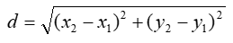

# 과제

###### 2022 2학년 1학기 C++프로그래밍 과제 모음


## 과제 1
#### 문제1. 길이가 10인 배열을 선언하고, 총 10개의 정수를 입력 받아서, 홀수와 짝수를 구분 지어서 출력하는 프로그램을 작성해 보자. 일단 홀수부터 출력하고 나서, 짝수를 출력하도록 하자. 단 10개의 정수는 main 함수 내에서 입력 받도록 하고, 배열을 인자로 받아서 배열 내에 존재하는 홀수만을 출력하는 함수와 짝수만을 출력하는 함수를 각각 정의해서 이 함수들을 호출하는 형식으로 프로그램을 작성하자.

```c++
#include <stdio.h>

int num[10]; // 정수를 저장하기위한 배열 선언
void odd(int n[]); // 홀수 출력 함수 선언
void even(int n[]); // 짝수 출력 함수 선언

int main() { 

	for (int i = 0; i < 10; i++) { // 10회 반복하여
		scanf_s("%d", &num[i]); // 배열에 정수를 하나씩 저장
	}

	odd(num); // 홀수만 출력
	even(num); // 짝수만 출력

	return 0;
}

void odd(int n[]) { // 홀수 출력 함수

	printf("홀수출력: "); // 홀수출력 안내문구 출력

	for (int i = 0; i < 10; i++) { // 배열의 크기인 10만큼 반복하여
		if (n[i] % 2 != 0) { // i번째 원소가 홀수라면
			printf("%d ", n[i]); // i번째 원소 출력
		}
	}

}
void even(int n[]) { // 짝수 출력 함수

	printf("\n짝수출력: "); // 짝수출력 안내문구 출력

	for (int i = 0; i < 10; i++) { // 배열의 크기인 10만큼 반복하여
		if (n[i] % 2 == 0) { // i번째 원소가 짝수라면
			printf("%d ", n[i]); // i번째 원소 출력
		}
	}

}
```

#### 문제2. 길이가 10인 배열을 선언하고, 총 10개의 정수를 입력 받는다. 단 입력받은 숫자가 홀수이면 배열의 앞에서부터 채워나가고, 짝수이면 뒤에서부터 채워나가는 형식을 취하기로 하자. 따라서 사용자가 [1,2,3,4,5,6,7,8,9,10]을 입력했다면, 배열에는 [1,3,5,7,9,10,8,6,4,2]의 순으로 저장이 될 것이다. 최종적인 배열의 결과값을 화면에 출력하자.

```c++
#include <stdio.h>

int num[10]; // 입력한 정수를 저장하기 위한 배열 선언
int even_cnt = 0; // 짝수의 개수를 카운트하기 위해 선언
int odd_cnt = 0; // 홀수의 개수를 카운트하기 위해 선언

int main() {

	for (int i = 0; i < 10; i++) { // 10회 반복하여

		int a;
		scanf_s("%d", &a); // 정수를 한 개씩 입력받는다

		if (a % 2 != 0) { // 만약 홀수라면

			num[odd_cnt] = a; // 앞에서부터 채우기 시작하고
			odd_cnt += 1; // 홀수의 개수를 1 증가시킨다.

		}
		else { // 홀수가 아닌 짝수라면

			num[9 - even_cnt] = a; // 맨 뒤에서부터 채우기 시작하고
			even_cnt += 1; // 짝수의 개수를 1 증가시킨다.

		}
	}

	for (int i = 0; i < 10; i++) { // 10회 반복하여
		printf("%d ", num[i]); // 배열의 원소를 하나씩 출력한다.
	}

	return 0;

}
```

## 과제2
#### 문제1. 문제에서 주어진 2차원 데이터 배열을(배열의 행과 열 정보도 같이) 메모장 등의 텍스트 편집기를 이용하여 임의의 이름으로 파일을 저장(예 test.txt)하고, File 입출력 함수를 통하여 test.txt에 저장되어 있는 배열 정보와 데이터를 정확하게 읽고 출력해 보는 프로그램을 작성한다. (동적으로 배열을 할당 시 2차원 배열을 1차원 배열로 할당해도 상관없음) 
#### 각 행의 평균과 전체 데이터의 최소값, 최대값을 계산하고, 출력하는 프로그램을 추가하여 프로그램을 완성한다.

```c++
#define _CRT_SECURE_NO_WARNINGS
#include <stdio.h>
#include <stdlib.h>

int main() {

	FILE* fp = fopen("test.txt", "r"); // test.txt를 읽기 형식으로 연다.

	int rc[2] = { 0, 0 }; // 행과 열을 저장할 1차원 정수형 배열을 선언한다.
	int a = 0; // 행과 열을 저장할 때 필요한 정수형 변수 선언
	int num = NULL; // test.txt에서 숫자를 불러와 저장할 때 사용할 정수형 변수 선언
	int r = 0; // test.txt에서 숫자를 불러와 저장할 때 몇 번째 행인지 판단하기 위한 정수형 변수 선언
	int c = 0; // test.txt에서 숫자를 불러와 저장할 때 몇 번째 열인지 판단하기 위한 정수형 변수 선언
	int max = -2147483648; // 최대값을 구하기 위한 정수형 변수를 선언
	int min = 2147483647; // 최소값을 구하기 위한 정수형 변수 선언
	float total = 0; // 평균값을 구하기 위한 실수형 변수 선언
	int **arr; // 동적할당을 위한 정수형 이중포인터 선언
	int pm = 1; // 양수 음수 판단을 위한 정수형 변수 선언

	while (true) {

		int ch = fgetc(fp); // fp에서 문자를 하나씩 읽어옴

		if (ch - 48 >= 0 && ch - 48 <= 9) { // 만약 읽어온 문자가 0~9 사이라면

			num *= 10; // num에 10을 곱한 뒤
			num += ch - 48; // 읽어온 문자를 더함

		}
		else { // 만약 읽어온 문자가 0~9 사이에 없다면 해당 숫자가 끝났다는 의미이므로

			if (num != NULL) { // num이 NULL이 아닐 때

				rc[a] = num; // num을 rc[a]저장
				num = NULL; // num 초기화
				a++; // a를 1 증가

			}

		}

		if (a == 2) break; // 행과 열을 전부 읽어왔다면 while문 종료

	}

	arr = (int**)malloc(sizeof(int*) * rc[0]); // 읽어온 행의 수를 이용하여 arr에 동적할당.

	for (int i = 0; i < rc[0]; i++) { // 읽어온 열의 수를 이용하여

		arr[i] = (int*)malloc(sizeof(int) * rc[1]); // 행의 수 만큼 동적할당한 arr에 인덱스 표기법을 이용하여 열의 수만큼 동적할당.

	}

	num = NULL; // num초기화

	while (true) {

		int ch = fgetc(fp); // fp에서 문자를 하나씩 읽어옴

		if (ch == 45) { // 만약 읽어온 문자가 45('-')라면
			pm = -1; // pm에 -1 저장
		}
		else {

			if (ch - 48 == 0 && num == NULL) { // 만약 읽어온 문자가 0이고 num변수가 비어있다면

				arr[r][c] = 0; // arr[r][c]에 num 저장
				num = NULL; // num초기화
				c++; // c를 1증가
				pm = 1; // pm 초기화

			}else if (ch - 48 >= 0 && ch - 48 <= 9) { // 읽어온 문자가 0~9 사이라면

				num *= 10; // num에 10을 곱한 뒤
				num += ch - 48; // 읽어온 문자를 더함

			}else { // 만약 읽어온 문자가 0~9 사이에 없다면 해당 숫자가 끝났다는 의미이므로

				if (num != NULL) { // num이 NULL이 아닐 때

					arr[r][c] = num * pm; // arr[r][c]에 num * pm을 저장
					num = NULL; // num초기화
					c++; // c를 1증가
					pm = 1; // pm초기화

				}

			}

			if (c >= rc[1]) { // 만약 c가 열의 수보다 크거나 같다면

				c = 0; // c를 0으로 초기화
				r += 1; // r을 1 증가

			}

		}

		if (r == rc[0]) break; // r이 행의 수보다 크거나 같다면 while 탈출

	}

	for (int i = 0; i < rc[0]; i++) {

		for (int j = 0; j < rc[1]; j++) {

			total = total + arr[i][j]; // 행의 숫자를 전부 더함
			min = min > arr[i][j] ? arr[i][j] : min; // 작은 수가 나올 때 마다 최소값 변수에 저장
			max = max < arr[i][j] ? arr[i][j] : max; // 큰 수가 나올 때 마다 최대값 변수에 저장

		}

		printf("line_%d_ave: %f\n", i + 1, total / float(rc[1])); // 한 행이 끝날 때 마다 그 행의 평균값 출력
		total = 0; // total 변수 초기화

	}

	printf("total_max: %d\n", max); // 전체의 최대값 출력
	printf("total_min: %d\n", min); // 전체의 최소값 출력

	return 0; // 프로그램 종료

}
```

#### 문제2
#### [1] lena.raw 파일은 lena 영상(256x256 영상)파일로 이 영상을 저장할 메모리를 동적으로 할당한다.
#### [2] lena 영상에 대한 산술연산(+,-)을 수행하는 두 함수를 구현해 보자.
###### 2.1 덧셈연산: Addition(unsigned char *, int value) 함수 / 각화소 밝기값+value
###### 2.2 뺄셈연산: Subtraction(unsigned char*, int value) 함수 / 각화소 밝기값-value
###### [참고사항 1] 파일에서 영상(Size_X*Size_Y) 읽고, 쓰기 
###### fread(InImage, sizeof(unsigned char), Size_X*Size_Y, infile);   영상 읽어오기
###### fwrite(InImage, sizeof(unsigned char), Size_X*Size_Y, outfile); 영상 출력하기
###### 영상 한 화소의 자료형은 unsigned char로 하세요. 한 화소의 밝기값은 0~255 까지의 밝기값을 가진다.

```c++
#define _CRT_SECURE_NO_WARNINGS // scanf 오류를 무시하기 위해 사용
#define X 256 // 가로 크기
#define Y 256 // 세로 크기
#include <stdio.h>
#include <stdlib.h>

void Addition(unsigned char *arr[X], int value) { // 밝기 증가 함수

	for (int i = 0; i < Y; i++)
	{
		for (int j = 0; j < X; j++)
		{
			arr[i][j] = arr[i][j] + value; // value 만큼 밝기 증가
			if (arr[i][j] > 255) arr[i][j] = 255; // 클리핑: 255보다 클 경우 255로 고정
		}

	}

}

void Subtraction(unsigned char *arr[X], int value) { // 밝기 감소 함수

	for (int i = 0; i < Y; i++)
	{
		for (int j = 0; j < X; j++)
		{
			arr[i][j] = arr[i][j] - value; // value 만큼 밝기 감소
			if (arr[i][j] < 0) arr[i][j] = 0; // 클리핑: 0보다 작을 경우 0으로 고정
		}

	}

}

int main()
{
	int num; // 증가 또는 감소 선택을 위한 정수형 변수 선언

	unsigned char **OrgImg = (unsigned char**)calloc(Y, sizeof(unsigned char*)); // raw파일의 세로 크기만큼 동적할당

	for (int i = 0; i < Y; i++)
	{
		OrgImg[i] = (unsigned char*)calloc(X, sizeof(unsigned char)); // raw파일의 가로 크기만큼 동적할당

	}

	FILE *infile = fopen("lena_256x256.raw", "rb"); // 이진파일로 열기

	// int a = fread(OrgImg, sizeof(unsigned char**), 256*256, infile);

	for (int i = 0; i < 256; i++) {

		for (int j = 0; j < 256; j++) {

			OrgImg[i][j] = fgetc(infile); // 파일의 내용을 하나씩 불러와서 OrgImg에 저장

		}

	}

	fclose(infile); // 파일 닫기

	printf("1. 밝기 증가\n2. 밝기 감소\n>> "); // 밝기를 증가할지 감소할지 결정하기 위한 안내문구 출력
	scanf("%d", &num); // 번호를 num 변수에 저장

	if (num == 1) // 만약 증가라면
	{
		
		int value; // 증가시킬 값을 저장할 value 선언
		
		printf("밝기 변화: "); // 변화 값을 입력하라는 안내문구 출력
		scanf("%d", &value); // value 입력

		Addition(OrgImg, value); // OrgImg와 value값을 함수에 전달

	}
	else if (num == 2) // 만약 감소라면
	{

		int value; // 감소시킬 값을 저장할 value 선언

		printf("밝기 변화: "); // 변화 값을 입력하라는 안내문구 출력
		scanf("%d", &value); // value 입력

		Subtraction(OrgImg, value); // OrgImg와 value값을 함수에 전달

	}
	else {
		return 0; // 그 외의 숫자가 입력되면 프로그램 종료
	}

	FILE* outfile = fopen("lena_256x256.raw", "wb"); // 이진파일을 쓰기형식으로 오픈

	for (int i = 0; i < 256; i++) {

		for (int j = 0; j < 256; j++) {

			fputc(OrgImg[i][j], outfile); // OrgImg의 값을 하나씩 파일에 입력

		}

	}

	fclose(outfile); // 파일 닫기

	return 0; // 프로그램 종료

}
```

## 과제3
#### 문제1. 다음은 어느 인터넷 사이트 사용자에 대한 정보이다. 이러한 사용자 정보를 표현할 수 있는 구조체를 정의하고, 초기화한 후, 모든 사용자 정보를 모니터에 출력하는 함수를 포함하는 프로그램을 작성해 보자. 초기화는 사용자 정보가 기록되어 있는 파일정보(user.txt)를 개방하여(open) 초기화하고, 사용자 전체를 출력하는 함수(PrnUser(..))의 매개변수는 포인터를 사용하여 출력하도록 하자.

###### user.txt 파일 내용은 차례대로

###### 아이디     비밀번호     5개스테이지별 점수     마법 포인트   체력 포인트
###### ---------------------------------------------------------
###### denzang    sd933k      80  56  72  86  91       300          10010
###### zzazang    !@sd487    100  98  100 100 91     20000         19000
###### gochuzang  df321#4     34  54  70  48  54       400           5000
###### ---------------------------------------------------------

```c++
#define _CRT_SECURE_NO_WARNINGS
#include <stdio.h>
#include <stdlib.h>
#include <string.h>

typedef struct user_info { // 사용자 정보 저장을 위한 구조체 생성

    char id[50]; // 아이디
    char pw[50]; // 비밀번호
    int scores[5]; // 스테이지별 점수
    int magic_point; // 마법 포인트
    int health_point; // 체력 포인트

} ui;

void PrnUser(ui* users, int user_num); // 사용자 정보 출력 함수

int main() {

    char buffer[1000] = { 0 }; // 파일에서 읽어온 내용을 저장하기 위한 buffer 생성.
    int cnt = 0; // 라인수를 체크하기 위한 변수 생성
    int user_num = 0; // 사용자 수를 저장하기 위한 변수 생성
    FILE* fp = fopen("user.txt", "r"); // user.txt를 읽기모드로 open

    if (fp == NULL) { // 파일을 여는데 실패했다면
        printf("File Open Failed\n"); // 실패했다는 안내문구를 출력하고
        return 0; // 프로그램 종료
    }

    fread(buffer, 1000, 1, fp); // 파일 전체를 읽어와 buffer에 저장
    fclose(fp); // 파일 닫기

    // printf("buffer length: %d\n", strlen(buffer)); // buffer의 크기를 체크하기 위해 출력
    // printf("%s", buffer); // buffer의 내용을 체크하기 위해 출력

    for (int i = 0; i < strlen(buffer); i++) { // buffer의 길이만큼 반복하여
        if (buffer[i] == '\n') cnt++; // 만일 i번째 buffer가 줄바꿈 문자라면, cnt을 1 증가
    }

    if (buffer[strlen(buffer) - 1] == '\n') user_num = cnt - 3; // 만일 buffer의 마지막 문자가 줄바꿈문자라면 전체 cnt - 3이 user_num
    else user_num = cnt - 2; // 아니면 cnt - 2 가 user_num

    ui* users = (ui*)malloc(user_num * sizeof(ui)); // 사용자 수 만큼 ui 구조체 포인터를 동적할당
    char** lines = (char**)malloc((user_num + 1)* sizeof(char*)); // buffer에 저장되어있는 내용을 라인별로 나누어 저장하기 위해 user_num + 1만큼 동적할당

    for (int i = 0; i < user_num; i++) { // 각 line을 1024만큼 동적할당
        lines[i] = (char*)malloc(1024 * sizeof(char));
    }

    int a = 0; // 전체 라인수를 체크하기 위한 a 선언
    int b = 0; // 사용자 수를 체크하기 위한 b 선언

    char *str = strtok(buffer, "\n"); // buffer에서 줄바꿈 문자가 나오기 전까지 잘라서 str에 저장

    while (str != NULL) { // str이 안비어있으면 계속 반복하여
       if (b < user_num && a >= 2) { // 만약 b가 전체 사용자 수보다 작고 a가 2보다 크거나같다면
            // printf("\nwhile_line_%d: %s\n", b, str);
            strcpy(lines[b], str); // str의 내용이 사용자의 정보이기 때문에 lines[b]에 복사.
            b++; // b를 1 증가
        }
        else if (b > user_num) break; // 만일 b가 전체 사용자 수 보다 크다면 반복문 탈출
        str = strtok(NULL, "\n"); // str에 다음 줄바꿈 문자가 나올 때 까지 잘라서 저장
        a++; // a를 1 증가
    }

    for (int i = 0; i < user_num; i++) { // 사용자 수 만큼 반복하여
        strcpy(users[i].id, strtok(lines[i], " ")); // 아이디 복사
        strcpy(users[i].pw, strtok(NULL, " ")); // 비밀번호 복사
        for (int j = 0; j < 5; j++) users[i].scores[j] = atoi(strtok(NULL, " ")); // 5번 반복하여 스테이지별 점수 저장
        users[i].magic_point = atoi(strtok(NULL, " ")); // 마법 포인트 저장
        users[i].health_point = atoi(strtok(NULL, " ")); // 체력 포인트 저장

    }

    //for (int i = 0; i < user_num; i++) { // 각 라인의 내용을 라인 번호와 함께 출력
    //    printf("\n\nlies_line_%d: %s", i + 1, lines[i]);
    //}

    //printf("\n사용자 수 : % d\n\n", user_num); // 사용자의 수가 몇인지 확인하기 위해 출력

    PrnUser(users, user_num); // 사용자의 정보를 저장한 구조체포인터와 사용자의 수를 매개변수로 전달하여 사용자 정보 출력

    return 0; // 프로그램 종료

}

void PrnUser(ui* users, int user_num) {

    for (int i = 0; i < user_num; i++) { // 매개변수로 전달받은 사용자의 수 만큼 반복하여
        printf("\n<%d번째 사용자>\n", i + 1); // i+1번째 사용자의 정보를 출력한다는 안내문구 출력
        printf("아이디: %s\n비밀번호: %s\n", users[i].id, users[i].pw); // i+1번째 사용자의 아이디와 비밀번호 출력
        for (int j = 0; j < 5; j++) { // i+1번째 사용자의 1~5 스테이지별 점수 출력
            printf("%d 스테이지 점수: %d점\n", j + 1, users[i].scores[j]);
        }
        printf("마법 포인트: %d\n체력 포인트: %d\n", users[i].magic_point, users[i].health_point); // i+1번째 사용자의 마법포인트와 체력포인트 출력
    }

}
```

#### 문제2. 문자열을 인자로 받는 함수가 있다. 이 함수에서는 이 문자열의 내용을 뒤집은 문자열을 새로 만들어서 반환하는데, 이때 동적메모리를 할당해서 뒤집은 문자열을 저장한 후 반환하도록 다음 프로그램을 완성해 보자.

###### <주어진 코드>
```c++
#include <stdio.h>
#include <stdlib.h>

char* ReverseString(const char* src, int len); // 문자열을 뒤집는 함수

int main()
{
     char source[] = "InternetMedia Engineering";
     char* result = ReverseString(source, strlen(source));
     
     printf(“원본 문자열 : %s \n”, source);
     printf(“변경된 문자열 : %s \n”, result);
     
     free(result);

     return 0;
}

char * ReverseString(const char* src, int len)
{
   ....
}

```

```c++
#include <stdio.h>
#include <stdlib.h>
#include <string.h>

char* ReverseString(const char* src, int len); // 문자열을 뒤집는 함수

int main() {

    char source[] = "InternetMedia Engineering"; // 초기의 문자열 선언
    char* result = ReverseString(source, strlen(source)); // 결과 문자열 선언

    printf("원본 문자열 : %s \n", source); // 원본 문자열 출력
    printf("변경된 문자열 : %s \n", result); // 결과 문자열 출력

    free(result); // 할당 해제

    return 0; // 프로그램 종료

}

char* ReverseString(const char* src, int len){

    char* str = (char*)calloc(len + 1, sizeof(char)); // 문자열의 길이+1 만큼 동적할당

    for (int i = 0; i < len; i++) { // 문자열의 길이만큼 반복하여

        str[i] = src[len - 1 – i]; // 동적할당한 문자열 변수에 거꾸로 저장

    }

    return str; // 거꾸로 저장한 문자열 반환

}
```

## 과제4
#### 문제1. 다음 main 함수에서 필요로 하는 swap 함수를 함수 오버로딩조건을 만족하도록 구현해보자.
###### main

```c++
  int main() 
{ 
   int num1 = 20, num2 = 30; 
   swap(&num1, &num2); 
   std::cout << num1 << ' ' << num2 <<std::endl; 
   
   char ch1 = 'a',  ch2 = 'z' ; 
   swap(&ch1, &ch2); 
   std::cout << ch1 << ' ' << ch2 <<std::endl; 
   
   double db1 = 1.111,  db2 = '5.555' ; 
   swap(&db1, &db2); 
   std::cout << db1 << ' ' << db2 <<std::endl; 
   
   return 0; 
} 

```

```c++
#include <iostream>

using namespace std; // std namespace를 사용한다고 선언

void swap(int* a, int* b) { // 정수형 변수를 swap 하는 함수 선언 (오버로딩)

	int temp = *a;
	*a = *b;
	*b = temp;

}
void swap(char* a, char* b) { // 문자 변수를 swap 하는 함수 선언 (오버로딩)

	char temp = *a;
	*a = *b;
	*b = temp;

}
void swap(double* a, double* b) { // double 변수를 swap 하는 함수 선언 (오버로딩)

	double temp = *a;
	*a = *b;
	*b = temp;

}

int main() {

	int num1 = 20; // num1에 20 저장
	int num2 = 30; // num2 에 30 저장

	swap(&num1, &num2); // swap함수로 두 변수의 값 변경
	cout << num1 << ' ' << num2 << endl; // swap한 값 출력

	char ch1 = 'a'; // ch1에 'a' 저장
	char ch2 = 'z'; // ch2에 'b' 저장

	swap(&ch1, &ch2); // swap함수로 두 변수의 값 변경
	cout << ch1 << ' ' << ch2 << endl; // swap한 값 출력

	double db1 = 1.111; // db1에 1.111 저장
	double db2 = 5.555; // db2에 5.555 저장

	swap(&db1, &db2); // swap함수로 두 변수의 값 변경
	cout << db1 << ' ' << db2 << endl; // swap한 값 출력

	return 0; // 프로그램 종료

}
```

#### 문제2. 함수가 호출될 때 사용되는 두 개의 매개변수 중에서 작은 값을 반환하는 min(..)이라는 함수를 구현해보자. min() 함수가 매개변수로서 int 형 정수, float형, double 형 실수를 가질 수 있도록 함수를 오버로딩하고 그 예를 보이는 프로그램을 작성하자. 

```c++
#include <iostream>

using namespace std; // std namespace를 사용한다고 선언

int min(int a, int b) { // 두 정수 중 더 작은 값을 리턴하는 함수선언

	return a < b ? a : b;

}

float min(float a, float b) { // 두 float 중 더 작은 값을 리턴하는 함수 선언
	
	return a < b ? a : b;

}

double min(double a, double b) { // 두 double 중 더 작은 값을 리턴하는 함수 선언

	return a < b ? a : b;

}

int main() {

	int i1, i2; // 두 int형 변수를 저장할 i1, i2를 선언
	float f1, f2; // 두 float형 변수를 저장할 f1, f2를 선언
	double d1, d2; // 두 double형 변수를 저장할 d1, d2를 선언

	cout << "\n두 int형 변수를 입력하시오.\n>> "; // 두 int형 변수를 입력하라는 안내문구 출력
	cin >> i1 >> i2; // 두 int형 변수 입력
	cout << "두 int 중 가장 작은 값: " << min(i1, i2) << endl; // min함수를 통해 더 작은 수 출력

	cout << "\n두 float형 변수를 입력하시오.\n>> "; // 두 float형 변수를 입력하라는 안내문구 출력
	cin >> f1 >> f2; // 두 float형 변수 입력
	cout << "두 float 중 가장 작은 값: " << min(f1, f2) << endl; // min함수를 통해 더 작은 수 출력

	cout << "\n두 double형 변수를 입력하시오.\n>> "; // 두 double형 변수를 입력하라는 안내문구 출력
	cin >> d1 >> d2; // 두 double형 변수 입력
	cout << "두 double 중 가장 작은 값: " << min(d1, d2) << endl; // min함수를 통해 더 작은 수 출력

	return 0; // 프로그램 종료

}
```

#### 문제3. 정수 매개변수의 부호를 바꾸는 함수 neg(..)를 작성해보자. 포인터 매개변수를 사용해서, 그리고 레퍼런스 매개변수를 사용해서 두가지 버전의 함수를 작성해보자. 2가지 함수에 대한 동작하는 것을 보여주는 간단한 프로그램을 작성해서 그 동작내용을 보여주세요.

```c++
#include <iostream>

using namespace std; // std namespace를 사용한다고 선언

int neg(int* a) { // 포인터 매개변수를 사용한 정수 부호 변환 함수 선언

	return (-1) * (*a);

}

int neg(int& a) { // 레퍼런스 매개변수를 사용한 정수 부호 변환 함수 선언

	return (-1) * a;

}

int main() {

	int a; // 정수형 변수 a 선언
	int* a_p = &a; // a의 포인터 변수 선언
	int& a_r = a; // a이 레퍼런스 변수 선언

	cin >> a; // 정수 입력

	cout << "포인터 매개변수: " << neg(*a_p) << endl; // 포인터 매개변수를 사용한 neg함수 리턴값 출력
	cout << "레퍼런스 매개변수: " << neg(&a_r) << endl; // 레퍼런스 매개변수를 사용한 neg함수 리턴값 출력

	return 0; // 프로그램 종료

}
```

## 과제5
#### 문제1. 직사각형을 나타내는 Rectangle 클래스와 원을 나타내는 Circle 클래스를 디자인 해 보자. 이 두 클래스는 넓이를 구하는 기능과 둘레를 구하는 기능(함수)을 가지고 있다. 다음에 제공되는 main 함수와 출력결과를 통해서 요구되는 Rectangle 클래스와 Circle 클래스를 디자인해 전체 프로그램을 완성해 보자. 
###### main
```c++
int main(void) 
{ 
  Rectangle rec(3, 4);  초기화로 Rectangle rec(가로(cm), 세로(cm)) 
  cout << "면적: “ << rec.GetArea() << endl; 
  cout << "둘레: “ << rec.GetRound() << endl; 

  Circle ring(5);  초기화로 Circle ring(원의 반지름 길이(cm)) 
  cout << "면적: “ << ring.GetArea() << endl; 
  cout << "둘레: “ << ring.GetRound() << endl; 

  return 0; 
} 
```

```c++
#include <iostream>

using namespace std;

class Rectangle { // Rectangle 클래스 정의

	int w, h; // private 변수 w, h를 정수형으로 선언

public:

	Rectangle(int a, int b) { // Rectangle(a, b)로 w, h를 입력할 수 있도록 함수 선언

		w = a;
		h = b;

	}

	int GetArea() { // 직사각형의 면적을 리턴하는 함수 정의

		return w * h;

	}

	int GetRound() { // 직사각형의 둘레를 리턴하는 함수 정의

		return w * 2 + h * 2;

	}

};

class Circle { // Circle 클래스 정의

	double r; // 반지름을 저장할 r 을 double로 선언

public:

	Circle(int a) { // Circle(r)로 반지름의 길이를 입력할 수 있도록 함수 선언

		r = a;

	}

	double GetArea() { // 원의 면적을 리턴하는 함수 정의

		return r * r * 3.14;

	}

	double GetRound() { // 원의 둘레를 리턴하는 함수 정의

		return 2 * r * 3.14;

	}

};

int main(void)
{
	Rectangle rec(3, 4); // 직사각형의 가로, 세로 길이를 3, 4로 선언
	cout << "면적: " << rec.GetArea() << endl; // 직사각형의 면적 출력
	cout << "둘레: " << rec.GetRound() << endl; // 직사각형의 둘레 출력

	Circle ring(5); // 원의 반지름을 5로 선언
	cout << "면적: " << ring.GetArea() << endl; // 원의 면적 출력
	cout << "둘레: " << ring.GetRound() << endl; // 원의 둘레 출력

	return 0;
}
```

#### 문제2. 다음에 해당하는 프로그램을 순차적으로 완성해보자. 2차원 평면의 좌표를 위한 Point 클래스를 정의하자(수업시간에 사용한 클래스 수정해서 사용가능). Point 클래스에 대한 멤버변수와 멤버함수는 다음과 같다.

###### 멤버변수: x, y (2차원 평면의 한 점의 좌표)
###### SetX, SetY 함수: 멤버변수 좌표 값 x, y를 설정하는 함수
###### GetX 함수, GetY 함수: 좌표 값 x, y 를 각각 리턴하는 함수 
###### ShowData 함수: 객체의 모든 정보를 화면에 출력해 주는 함수
###### double Distance(Point &p1) 함수: 자기 자신의 Point 객체와 전달된 Point 객체 사이의 거리를 리턴 하는 함수. 두 점간의 거리(d)는 다음과 같다.



###### GetArea 함수: 0를 리턴한다. 
###### GetVolume 함수: 0을 리턴한다. 
###### GetName 함수: “Point" 문자를 리턴하는 함수.   

###### 위와 같은 Point 클래스를 이용하여, 정의된 멤버함수의 사용 예를 보이고, 두 객체간의 거리를 계산하여 출력하는 프로그램을 완성해보자. 이 때 두 점은 Point p1(1,2), p2(7,8)의 거리를 계산하여 출력하자.

```c++
#include <iostream>
#include <math.h> // 제곱근 계산을 위해 include

using namespace std;

class Point { // Point 클래스 선언

	int x, y; // private 변수 x, y를 정수형으로 선언

public:

	void SetX(int a) { // x좌표를 설정하는 함수 정의
		x = a;
	}
	void SetY(int b) { // y좌표를 설정하는 함수 정의
		y = b;
	}
	int GetX() { // x좌표의 값을 리턴하는 함수 정의
		return x;
	}
	int GetY() { // y좌표의 값을 리턴하는 함수 정의
		return y;
	}
	void ShowData() { // x, y좌표의 값을 출력하는 함수 정의
		cout << "(x, y): (" << x << ", " << y << ")\n";
	}
	double Distance(Point& p1) { // 또 다른 점을 매개변수로 하는 함수 선언
		return sqrt((x - p1.GetX()) * (x - p1.GetX()) + (y - p1.GetY()) * (y - p1.GetY())); // 현재의 점과 또 다른 점 사이의 거리를 계산하여 리턴
	}
	int GetArea() { // 면적을 리턴하는 함수 정의
		return 0;
	}
	int GetVolume() { // 부피를 리턴하는 함수 정의
		return 0;
	}
	string GetName() { // "Point"를 리턴하는 함수 정의
		string name = "Point";
		return name;
	}

};

int main(void)
{

	Point p1, p2; // Point 변수 p1, p2선언

	p1.SetX(1); // p1의 x좌표를 1로 설정
	p1.SetY(2); // p1의 y좌표를 2로 설정

	p2.SetX(7); // p2의 x좌표를 7로 설정
	p2.SetY(8); // p2의 y좌표를 8로 설정

	cout << "<GetX() & GetY() 사용 결과>\n"; // GetX(), GetY 함수 사용 결과
	cout << "p1 좌표: (" << p1.GetX() << ", " << p1.GetY() << ")\n";
	cout << "p2 좌표: (" << p2.GetX() << ", " << p2.GetY() << ")\n\n";
	
	cout << "<ShowData() 사용 결과>\n"; // ShowData() 함수 사용 결과
	p1.ShowData();
	p2.ShowData();
	cout << "\n";

	cout << "<Distance(Point &p1) 사용 결과>\n"; // Distance 함수 사용 결과
	cout << "Distance : " << p1.Distance(p2) << "\n\n";

	cout << "<GetArea() 사용 결과>\n"; // GetArea() 함수 사용 결과
	cout << "p1 Area : " << p1.GetArea() << "\n";
	cout << "p2 Area : " << p2.GetArea() << "\n\n";

	cout << "<GetVolume 사용 결과>\n"; // GetVolume() 함수 사용 결과
	cout << "p1 Volume : " << p1.GetVolume() << "\n";
	cout << "p2 Volume : " << p2.GetVolume() << "\n\n";

	string name1 = p1.GetName(); // GetName 함수 사용
	string name2 = p2.GetName(); // GetName 함수 사용

	cout << "<GetName() 사용 결과>\n"; // GetName() 함수 사용
	cout << "p1.GetName(): " << name1 << "\n";
	cout << "p2.GetName(): " << name2 << "\n\n";
	
	return 0;
}
```

## 과제6
#### 문제1. 지난주 과제 5에서 설계한 Rectangle, Circle, Point 클래스를 생성자함수와 소멸자함수를 추가해서 각각의 클래스를 수정해보자.

```c++
#include <iostream>

using namespace std;

class Rectangle {

	double x1, x2, y1, y2;

public:

	Rectangle();
	double GetArea();
	double GetRound();
	~Rectangle();

};

Rectangle::Rectangle() {
	
	cout << "Constructor Function::\n";

	cout << "x1, y1 = ";
	cin >> x1 >> y1;

	cout << "x2, y2 = ";
	cin >> x2 >> y2;

}

double Rectangle::GetArea() {

	double w = (x1 - x2) > 0 ? (x1 - x2) : (x2 - x1);
	double h = (y1 - y2) > 0 ? (y1 - y2) : (y2 - y1);

	return w * h;

}

double Rectangle::GetRound() {

	double w = (x1 - x2) > 0 ? (x1 - x2) : (x2 - x1);
	double h = (y1 - y2) > 0 ? (y1 - y2) : (y2 - y1);

	return w * 2 + h * 2;

}

Rectangle::~Rectangle() {

	x1 = 0;
	x2 = 0;
	y1 = 0;
	y2 = 0;

	cout << "Destructor Function::\n";

}

class Circle {

	double x, y, r;

public:

	Circle();
	double GetArea();
	double GetRound();
	~Circle();

};

Circle::Circle() {

	cout << "Contructor Function::\n";
	cout << "x, y, r = ";

	cin >> x >> y >> r;

}

double Circle::GetArea() {

	return r * r * 3.14;

}

double Circle::GetRound() {

	return 2 * r * 3.14;

}

Circle::~Circle() {

	x = 0;
	y = 0;
	r = 0;

	cout << "Distructor Function::\n";

}

class Point {

	double x, y;

public:

	Point();
	void SetX(double a);
	void SetY(double b);
	double GetX();
	double GetY();
	void ShowData();
	double Distance(Point& p);
	double GetArea();
	double GetVolume();
	string GetName();
	~Point();

};

void Point::SetX(double a) {

	x = a;

}

void Point::SetY(double b) {

	y = b;

}

Point::Point() {

	cout << "Constructor Function::\n";
	cout << "x, y";
	cin >> x >> y;

}

double Point::GetX() {

	return x;

}

double Point::GetY() {

	return y;

}

void Point::ShowData() {

	cout << "x: " << x << endl << "y: " << y << endl;

}

double Point::Distance(Point& p) {

	return sqrt((x - p.GetX()) * (x - p.GetX()) + (y - p.GetY()) * (y - p.GetY()));

}

double Point::GetArea() {

	return 0;

}

double Point::GetVolume() {

	return 0;

}

string Point::GetName() {

	return "Point";

}

Point::~Point() {

	x = 0;
	y = 0;

	cout << "Distructor Function::\n";

}

int main() {

	return 0;

}
```

#### 문제2. 다음 프로그램은 Book이라는 클래스를 나름대로 설계하여 그 사용 예를 프로그램 한 것이다. 이것을 실행하면 실행에러가 나타난다. 그 이유를 설명하고 실행 에러를 수정하기 위해 코드를 추가해서 프로그램이 동작하도록 완성해 보자.  

###### 코드
```c++
#include <iostream> 
using namespace std;
class Book 
{ 
         char *title; 
   public: 
           Book(char*); 
         ~Book(){ 
                   delete title; 
           } 
           void showtitle(void); 
};

Book::Book(char *string = NULL) 
{ 
      int len;
      len = strlen(string);
        title = new char[len+1];  // 메모리 동적 할당 
        strcpy_s(title,len+1,string); 
}

void Book::showtitle(void) 
{ 
          cout << title << endl; 
}

void main(void) 
{ 
        Book Book1("A C++ Programming"); 
        Book Book2 = Book1; 
   
        Book1.showtitle(); 
        Book2.showtitle(); 
} 
```

```c++
#include <iostream>

using namespace std;

class Book {

	char* title;

public:

	Book(const char*); // Book Book1("A C++ Programming");에서 문자열 상수를 사용했기 때문에 const를 써줘야 한다.
	Book(Book& b);
	~Book() {

		delete title;

	}
	void showtitle(void);

};

Book::Book(const char* string = NULL) {
	
	int len;

	len = strlen(string);
	title = new char[len + 1];
	strcpy_s(title, len + 1, string);

}

Book::Book(Book& b) { // 복사 생성자 함수를 선언해줘야함. 자기자신과 같은 형태의 객체를 인자로 받을 수 있는 생성자 함수임. 생성자 함수의 오버로딩 된 형태. 매개변수 선언시에 &선언을 해주어야 무한루프에 빠지지 않고 에러가 발생하지 않는다.

	int len;

	len = strlen(b.title);
	title = new char[len + 1];
	strcpy_s(title, len + 1, b.title);

}

void Book::showtitle() {

	cout << title << endl;

}

int main() {

	Book Book1("A C++ Programming");
	Book Book2 = Book1;

	Book1.showtitle();
	Book2.showtitle();

	return 0;

}
```

#### 문제3. 계산기 기능을 하는 Calculator라는 이름의 클래스를 작성해 보자. 기본적으로 지니고 있는 기능은 덧셈, 뺄셈, 곱셈 그리고 나눗셈이며, 연산을 할 때마다 어떠한 연산을 몇 번 했는지 기록되어야 한다. 다음에 제공되는 main 함수와 출력결과를 통해서 요구되는 Calculator 클래스를 디자인 해 보자. 단, 멤버변수는 private로, 멤버함수는 public으로 선언을 하자. 

###### main
```c++
int main(void) 
{ 
   Calculator  cal;  
 // 멤버변수는 2개의 int 변수를 가지고, 적절한 생성자  함수를 구현하자.  

      
   cout << "3+5 =  " << cal.Add(3,5) << endl; 
   cout << "3/5 =  " << cal.Div(3,5)  << endl; 
   cout << "12-4 =  " << cal.Min(12,4) << endl; 
   cout << "12/4 =  " << cal.Div(12,4) << endl;
   cal.ShowOpCount();
  
  // 멤버함수인  ShowOpCount 는  그 객체에서 수행한 덧셈, 뺄샘, 곱셈, 나눗셈을 수행한 회수를 화면에 출력한다.

   return 0; 
}
```

```c++
#include <iostream>

using namespace std;

class Calculator {

	int* cnt;

public:

	Calculator();
	~Calculator();
	double Add(double a, double b);
	double Div(double a, double b);
	double Min(double a, double b);
	double Mul(double a, double b);
	void ShowOpCount();

};

Calculator::Calculator() {

	cout << "Constructor Function::Calculator class\n";
	cnt = (int*)calloc(4, sizeof(int));

}

double Calculator::Add(double a, double b) {

	cnt[0] += 1;

	return a + b;

}

double Calculator::Div(double a, double b) {

	cnt[1] += 1;

	return a / b;

}

double Calculator::Min(double a, double b) {

	cnt[2] += 1;

	return a - b;

}

double Calculator::Mul(double a, double b) {

	cnt[3] += 1;

	return a * b;

}

void Calculator::ShowOpCount() {

	cout << "덧셈: " << cnt[0] << endl;
	cout << "뺄셈: " << cnt[1] << endl;
	cout << "곱셈: " << cnt[2] << endl;
	cout << "나눗셈: " << cnt[3] << endl;

}

Calculator::~Calculator() {

	cout << "Destructor Function::Calculator class\n";
	delete[]cnt;

}

int main() {

	Calculator cal;

	cout << "3 + 5 = " << cal.Add(3, 5) << endl;
	cout << "3 / 5 = " << cal.Div(3, 5) << endl;
	cout << "12 - 4 = " << cal.Min(12, 4) << endl;
	cout << "12 / 4 = " << cal.Mul(12, 4) << endl;

	cal.ShowOpCount();

	return 0;

}
```

## 과제 7
#### 문제1. 주사위를 나타내는 클래스인 Dice를 설계해 보자. Dice 클래스에 필요한 멤버변수와 멤버함수를 생각하여보자. 멤버함수에는 주사위를 굴리는 행위(기능)인 roll(..) 을 포함하자. roll() 멤버함수를 작성할 때는 난수를 얻는 다음 분장을 참조하자.

###### face = (int)(rand()%6 +1)
###### Dice 객체를 생성하여 테스트 해 보자.
###### 테스트는 주사위를 N번 던졌을 때 주사위 숫자의 평균값을 계산하여 모니터에 출력해 보자. (N=10, 100일때 각각)

```c++
#include <iostream>
#include <random>

using namespace std;

class Dice {

	int n = 0;
	int value = 0;

public:

	Dice();
	Dice(int a);
	Dice(Dice& k);
	~Dice();

	double roll();

};

Dice::Dice() {

	int n = 0;
	int value = 0;

}

Dice::Dice(int a) {

	n = a;

}

Dice::Dice(Dice& k) {

	n = k.n;
	value = k.value;

}

Dice::~Dice() {

	int n = 0;
	int value = 0;

}

double Dice::roll() {

	for (int i = 0; i < n; i++) {

		value += (int)(rand() % 6 + 1);

	}
	
	return (double)value / (double)n;

}

int main() {

	Dice d(100);
	Dice dd(10);
	
	cout << "d.roll result(times = 100): " << d.roll() << endl;
	cout << "dd.roll result(times = 10): " << dd.roll() << endl;

	return 0;

}
```

#### 문제2. 명함정보를 지닐 수 있는 NameCard라는 클래스를 설계해 보자. NameCard 클래스는 이름, 전화번호, 주소, 직급정보(부장/과장/대리/사원)를 가지고 있고, 전화번호/주소/직급정보를 변경할 수 있는 기능도 가지고 있다.  생성자 내에서 동적으로 메모리를 할당하고, 소멸자에서 할당받은 메모리를 해제하는 형식으로 구현해 보자. (멤버변수는 private 로 정의하세요.)
#### 사용자로부터 NameCard 객체에 들어갈 데이터를 입력받기로 하자. 총 3명의 데이터를 순차적으로 입력받고, 입력이 완료되면, 다시 순차적으로 출력하는 형태로 main 함수의 프로그램을 작성해 보자.  NameCard의 멤버함수(생성자, 소멸자 함수 포함)를 적절하게 구현해 보세요.

###### example
```c++
const int SIZE = 3;
const int LEN =30;

int main()
{
   NameCard* arr[SIZE];   // SIZE 명의 NameCard 객체를 가리키는 NameCard 포인터 배열
   char name[LEN]; 
   char phone[LEN];
   char address[LEN];
   char position[LEN];

   for(int i = 0 ; i < SIZE ; i++){
     cout << “ Name Card 데이터 입력 “ << endl;
     cout << “이름: ” ;
     cin >> name;
     cout << “전화번호: “;
     cin >> phone;
     cout << “주소: “ ;
     cin >> address;
     cout << “직급 : “;
     cin >>position;
      arr[i] = new NameCard(name, phone, address, position);
   }
    
  for(int j=0 ; j < SIZE ; j++)
  {
      ----   입력된 NameCard 정보 출력 완성하기 ----
   }

   return 0;
}
```

```c++
#define _CRT_SECURE_NO_WARNINGS
#include <iostream>
#include <string.h>

using namespace std;

const int SIZE = 3;
const int LEN = 30;

class NameCard {

	char* name;
	char* phone_num;
	char* address;
	char* rank;

public:

	NameCard();
	NameCard(NameCard& user);
	NameCard(const char* name_, const char* phone_num_, const char* address, const char* rank_);
	~NameCard();

	void print_user();
	void edit();

};

NameCard::NameCard() {

	string name_;
	string pn_;
	string ad_;
	string ra_;

	cout << "이름: ";
	cin >> name_;

	cout << "전화번호('-' 없이): ";
	cin >> pn_;

	cout << "주소: ";
	cin >> ad_;

	cout << "직급: ";
	cin >> ra_;

	name = (char*)calloc(name_.length() + 1, sizeof(char));
	phone_num = (char*)calloc(pn_.length() + 1, sizeof(char));
	address = (char*)calloc(ad_.length() + 1, sizeof(char));
	rank = (char*)calloc(ra_.length() + 1, sizeof(char));

	strcpy_s(name, name_.length() + 1, name_.c_str());
	strcpy_s(phone_num, pn_.length() + 1, pn_.c_str());
	strcpy_s(address, ad_.length() + 1, ad_.c_str());
	strcpy_s(rank, ra_.length() + 1, ra_.c_str());

}

NameCard::NameCard(NameCard& user) {

	int size;

	size = strlen(user.name);
	name = (char*)calloc(size + 1, sizeof(char));
	strcpy_s(name, size + 1, user.name);

	size = strlen(user.phone_num);
	phone_num = (char*)calloc(size + 1, sizeof(char));
	strcpy_s(phone_num, size + 1, user.phone_num);

	size = strlen(user.address);
	address = (char*)calloc(size + 1, sizeof(char));
	strcpy_s(address, size + 1, user.address);

	size = strlen(user.rank);
	rank = (char*)calloc(size + 1, sizeof(char));
	strcpy_s(rank, size + 1, user.rank);

}

NameCard::NameCard(const char* name_, const char* phone_num_, const char* address_, const char* rank_) {

	int size;

	size = strlen(name_);
	name = (char*)calloc(size + 1, sizeof(char));
	strcpy_s(name, size + 1, name_);

	size = strlen(phone_num_);
	phone_num = (char*)calloc(size + 1, sizeof(char));
	strcpy_s(phone_num, size + 1, phone_num_);

	size = strlen(address_);
	address = (char*)calloc(size + 1, sizeof(char));
	strcpy_s(address, size + 1, address_);

	size = strlen(rank_);
	rank = (char*)calloc(size + 1, sizeof(char));
	strcpy_s(rank, size + 1, rank_);

}

NameCard::~NameCard() {

	delete name;
	delete phone_num;
	delete address;
	delete rank;

}

void NameCard::print_user() {

	cout << "\n<Name Card 데이터 출력>\n";
	cout << "이름: " << name << endl;
	cout << "전화번호: " << phone_num << endl;
	cout << "주소: " << address << endl;
	cout << "직급: " << rank << endl;

}

void NameCard::edit() {

	int n;

	this->print_user();
	cout << "\n변경할 데이터를 선택하세요.\n1. 이름\n2. 전화번호\n3. 주소\n4. 직급\n5. 취소\n>> ";

	cin >> n;

	if (n == 1) {

		string name_;
		
		cout << "\n변경할 이름을 입력하세요.\n>> ";
		cin >> name_;

		free(name);
		name = (char*)calloc(name_.length(), sizeof(char));
		strcpy_s(name, name_.length() + 1, name_.c_str());

	}
	else if (n == 2) {

		string pn_;

		cout << "\n변경할 전화번호를 입력하세요.\n>> ";
		cin >> pn_;

		free(phone_num);
		phone_num = (char*)calloc(pn_.length(), sizeof(char));
		strcpy_s(phone_num, pn_.length() + 1, pn_.c_str());

	}
	else if (n == 3) {

		string addres_;

		cout << "\n변경할 주소을 입력하세요.\n>> ";
		cin >> addres_;

		free(address);
		address = (char*)calloc(addres_.length(), sizeof(char));
		strcpy_s(address, addres_.length() + 1, addres_.c_str());

	}
	else if (n == 4) {

		string rank_;

		cout << "\n변경할 직급을 입력하세요.\n>> ";
		cin >> rank_;

		free(rank);
		rank = (char*)calloc(rank_.length(), sizeof(char));
		strcpy_s(rank, rank_.length() + 1, rank_.c_str());

	}
	else if (n == 5) {

		cout << "\n데이터 변경을 취소합니다.\n";

	}
	else {

		cout << "\n해당 선택지가 존재하지 않습니다.\n";

	}

}

int main() {

	NameCard* arr[SIZE];
	char name[LEN];
	char phone[LEN];
	char address[LEN];
	char position[LEN];

	for (int i = 0; i < SIZE; i++) {

		cout << "<Name Card 데이터 입력>" << endl;
		cout << "이름: ";
		cin >> name;
		cout << "전화번호: ";
		cin >> phone;
		cout << "주소: ";
		cin >> address;
		cout << "직급: ";
		cin >> position;

		arr[i] = new NameCard(name, phone, address, position);

	}

	cout << "\n\n<Name Card 데이터 출력>\n\n";

	for (int i = 0; i < SIZE; i++) {

		arr[i]->print_user();

	}

	cout << "\n\n";

	for (int i = 0; i < SIZE; i++) {

		arr[i]->edit();

	}

	cout << "\n\n<Name Card 데이터 출력>\n\n";

	for (int i = 0; i < SIZE; i++) {

		arr[i]->print_user();

	}

	return 0;

}
```

## 과제 8
#### 문제1. Point 객체를 두 개 포함하는 Rectangle 클래스를 정의하고, 다음과 같은 main 함수를 수행할 수 있도록, Rectangle 클래스의 멤버변수와 멤버함수를 정의하세요.

```c++
class Rectangle 
{ 
    Point leftupper ;
    Point rightdown ;

public: 

}; 

int main(void) 
{ 
    Point p1(10, 20); 
    Point p2(20, 10);    
    Rectangle r1(p1,p2);  // 포함된 객체 생성을 위한 :초기화 필요
    r1.Center(); // Rectangle r1의 중심좌표 출력 
    r1.Display(); // Rectangle r1의 면적, 주변길이를 출력 

    Rectangle r2 = r1;  // 복사 생성자 함수 정의 필요
    r2.Center();
    r2.Display();  
   
     return 0; 
} 
```

```c++
#include <iostream>

using namespace std;

class Point {

	double x, y;

public:

	Point() {

		// cout << "Point 객체를 생성합니다." << endl;
		x = 0;
		y = 0;

	}

	Point(double _x, double _y) {

		x = _x;
		y = _y;
		// cout << "Point (" << x << ", " << y << ") 를 생성 합니다." << endl;

	}

	Point(Point& _p) {

		x = _p.x;
		y = _p.y;
		// cout << "Point (" << x << ", " << y << ") 를 복사 합니다." << endl;

	}

	~Point() {

		// cout << "Point (" << x << ", " << y << ") 를 초기화 합니다." << endl;
		x = 0;
		y = 0;

	}

	double GetX() {

		return x;

	}

	double GetY() {

		return y;

	}

};

class Rectangle {

	Point leftupper;
	Point rightdown;

public:

	Rectangle(Point& _leftupper, Point& _rightdown) {

		leftupper = _leftupper;
		rightdown = _rightdown;

	}

	Rectangle(Rectangle& _r) {

		leftupper = _r.leftupper;
		rightdown = _r.rightdown;

	}

	void Center() {

		cout << "중심 좌표: (" << (rightdown.GetX() + leftupper.GetX()) / 2 << ", " << (leftupper.GetY() + rightdown.GetY()) / 2 << ")" << endl;

	}

	void Display() {

		cout << "면적: " << (rightdown.GetX() - leftupper.GetX()) * (leftupper.GetY() - rightdown.GetY()) << endl;
		cout << "둘레: " << ((rightdown.GetX() - leftupper.GetX()) * 2) + ((leftupper.GetY() - rightdown.GetY()) * 2) << endl;

	}

};

int main() {

	Point p1(10, 20);
	Point p2(20, 10);
	Rectangle r1(p1, p2);

	r1.Center();
	r1.Display();

	Rectangle r2 = r1;

	r2.Center();
	r2.Display();

	return 0;

}
```

#### 문제2. 실수부와 허수부로 되어 있는 복소수를 표현하고, 사칙연산이 가능한 Complex 클래스를 정의하고, 그 사용 예를 보여라. Complex 클래스 정의 시 다음과 같은 특징을 고려하여 설계하세요.

###### 생성자 함수에서는 실수부와 허수부를 초기화하라.
###### 예) Complex a(1,2); // a = 1+2i로 객체 생성과 더불어 초기화

###### 복소수 12.4 + 15.6i를 Console 화면에 출력할 수 있는 기능을 포함하여야 하며, 
###### Complex 클래스의 public 함수인 Display() 함수를 이용하여, Console 화면에 복소수를 출력하는 기능을 포함하라.

###### 복소수 사칙연산 기능 포함 예를 들어, 두 복소수 x = x1+y1i, y= x2+y2i 일 경우
###### add(z=x+y): z = (x1+x2) + (y1+y2)i
###### subtract(z=x-y): z = (x1-x2) + (y1-y2)i
###### multiply(z=x*y): z = (x1*x2 – y1*y2) + (x2*y1 + x1*y2)i
###### divide(z=x/y): z = (x1*x2+y1*y2)/(x2^2 + y2^2) + (x2*y1 - x1*y2)/(x2^2 + y2^2)i

###### 실수부와 허수부 값을 설정하고, 반환하는 함수 SetRe(), SetIm(), GetRe(), GetIm() 기능 포함

###### <결과화면>
###### ------------------------------------------
###### x=12.4 + 15.6i
###### y=4.3 + 2.1i

###### add(x+y)=16.7 + 17.7i
###### subtract(x-y)=8.1 + 13.5i
###### multiply(x*y)=20.56 + 93.12i
###### divide(x/y)=3.75895 + 1.79214i
###### Press any key to continue
###### ------------------------------------------

```c++
#include <iostream>
#include <Windows.h>

using namespace std;

class Complex {

	double a;
	double b;

public:

	Complex();
	Complex(double _a, double _b);
	Complex(Complex& _com);
	~Complex();

	double GetRe() { return a; }
	double GetIm() { return b; }
	void SetRe(double _a) { a = _a; }
	void SetIm(double _b) { b = _b; }

	void Display();
	void add(Complex& y);
	void subtract(Complex& y);
	void multiply(Complex& y);
	void divide(Complex& y);

};

Complex::Complex() {

	a = 0;
	b = 0;

}

Complex::Complex(double _a, double _b) {

	a = _a;
	b = _b;

}

Complex::Complex(Complex& _com) {

	a = _com.a;
	b = _com.b;

}

Complex::~Complex() {

	a = 0;
	b = 0;

}

void Complex::Display() {

	string s;

	if (b >= 0) {
		s = " + ";
	}
	else {
		s = " - ";
	}

	cout << a << s << b << "i" << endl;

}

void Complex::add(Complex& y) {

	string s;

	if (b + y.b >= 0) {
		s = " + ";
	}
	else {
		s = " - ";
	}

	cout << a + y.GetRe() << s << b + y.b << "i" << endl;

}

void Complex::subtract(Complex& y) {

	string s;

	if (b - y.GetIm() >= 0) {
		s = " + ";
	}
	else {
		s = " - ";
	}

	cout << a - y.GetRe() << s << b - y.GetIm() << "i" << endl;

}

void Complex::multiply(Complex& y) {

	string s;

	if (b * y.GetRe() + a * y.GetIm() >= 0) {
		s = " + ";
	}
	else {
		s = " - ";
	}

	cout << a * y.GetRe() - b * y.GetIm() << s << b * y.GetRe() + a * y.GetIm() << "i" << endl;

}

void Complex::divide(Complex& y) {

	string s;

	if ((b * y.GetRe() - a * y.GetIm())/(b * b + y.GetIm() * y.GetIm()) >= 0) {
		s = " + ";
	}
	else {
		s = " - ";
	}

	cout << (a * y.GetRe() + b * y.GetIm())/(y.GetRe() * y.GetRe() + y.GetIm() * y.GetIm()) << s << (b * y.GetRe() - a * y.GetIm()) / (y.GetRe() * y.GetRe() + y.GetIm() * y.GetIm()) << "i" << endl;

}

int main() {

	Complex x(12.4, 15.6);
	Complex y(4.3, 2.1);

	x.Display();
	y.Display();

	cout << "add(x + y) = ";
	x.add(y);

	cout << "subtract(x-y) = ";
	x.subtract(y);

	cout << "multiply(x*y) = ";
	x.multiply(y);

	cout << "divide(x/y) = ";
	x.divide(y);

	system("pause");

	return 0;

}
```

## 과제 9
#### 문제1. 다음 클래스는 은행 계좌정보를 담을 수 있도록 정의된 Account 클래스이다. 위 클래스를 public으로 상속하는 LAccount 클래스를 정의해보자. LAccount 클래스는 Account 클래스가 지니고 있는 멤버 변수 이외에 고객별 현금서비스 한도 정보(credit)와 고객별 신용도(credit rate: 0 ~ 1) 정보를 추가로 가지고 있다. 이러한 LAccount 클래스를 적당히 정의하고 그 사용 예를 보여라. 필요하다면 멤버 변수를 추가해도 상관 없다. 특히, 파생클래스 생성시 기반클래스 생성을 위한 생성자 함수를 잘 정의해보자.

###### 코드
```c++
#define _CRT_SECURE_NO_WARNINGS
#include <iostream>

using namespace std;

class Account {

	int acc_num;
	int balance;
	char name[20];

public:

	Account() {/*생성자 함수*/ }
	Account(int _acc_num, int _balance, const char* _name) {

		acc_num = _acc_num;
		balance = _balance;
		strcpy(name, _name);

	}
	~Account() {}

	void ShowData() {

		cout << "이름: " << name << endl;
		cout << "계좌번호: " << acc_num << endl;
		cout << "계좌잔액: " << balance << endl;

	}

};

class LAccount : public Account {

	int credit;
	int credit_rate;

public:

	LAccount() {/*생성자 함수*/ }
	LAccount(int _acc_num_, int _balance_, const char* _name_, int _credit, int _credit_rate) : Account(_acc_num_, _balance_, _name_){

		credit = _credit;
		credit_rate = _credit_rate;

	}
	~LAccount(){}

	void ShowData() {

		Account::ShowData();

		cout << "현금 서비스 한도: " << credit << endl;
		cout << "신용도: " << credit_rate << endl;
		cout << endl;

	}

};

int main() {

	LAccount p1(100, 5000, "김 삼순", 2000, 1);
	LAccount p2(101, -2000, "홍 길동", 100, 0.2);

	p1.ShowData();
	p2.ShowData();

	return 0;

}
```
#### 문제2
#### Step1. C++로 구현된 사원급여관리프로그램 Ver1.0을 실행시켜보자. 현재의 Ver1.0은 Visual Studio 버전에 따른 Bug를 포함하고 있다. Bug를 수정해서 실행해보자.
#### Step2. 실행된 Ver1.0 파일을 .h 파일과 .cpp 구현파일로 적절하게 분리해 보자.

###### main.cpp
```c++
/*****************************************************************************/
/* ____  _   __   ____       _   __     __   _   _     __   _____   ____  ____
| |   |  \/  | | |  |     |  \/  |   /| | | \ | |   /| | | | |_| | |   | |  |
| |-- | |  | | | |__|     | |  | |  /-| | | |\| |  /-| | | |___  | |-- | |_ |
|_|__ |_|\/|_| |_|        |_|\/|_| /  |_| |_| \_| /  |_| |_|_|_| |_|__ |_| \_

  VER 1.0
*/

#define MAX_EMPLOYEE 15
#define _CRT_SECURE_NO_WARNINGS

#include <iostream>
#include "Employee.h"
using namespace std;

void AddEmployee();          /* 기능 1(사원추가): 새로운 직원을 추가하는 함수 */
void SearchEmployee();       /* 기능 2(사원을 검색하는 함수 */
void ModifyEmployee();       /* 기능 3(사원을 수정하는 함수 */
void ShowAllEmployee();      /* 기능 4(사원전체 출력): 모든 사원의 정보를 화면에 출력하는 함수 */

int employeeNum = 0; //현재까지 입력된 사원 수 
Employee empList[MAX_EMPLOYEE]; //Employee 저장을 위한 배열 

int main()
{
	char key;

	cout << "\n 사원(급여)관리 프로그램 Version 1.0\n";
	while (1)
	{
		cout << "\n아래의 메뉴에서 원하는 기능을 선택하세요? \n \n";

		cout << " 1. 사원 추가\n";
		cout << " 2. 사원 검색(이름)\n";
		cout << " 3. 사원 정보수정(주소, 기본급여)\n";
		cout << " 4. 전체 사원 출력\n";
		cout << " q. 종료 \n \n";
		cout << " >> ";

		key = getchar();

		switch (key)
		{
		case '1':
			AddEmployee();
			break;

		case '2':
			SearchEmployee();
			break;

		case '3':
			ModifyEmployee();
			break;

		case '4':
			ShowAllEmployee();
			break;

		case 'q':
			cout << "프로그램을 종료합니다. \n";
			return 0;

		default:
			cout << "잘못된 입력입니다 . " << key << endl;
			break;
		}// 끝 switch(key)
	}// 끝 while(1)
}


/* 기능 1(사원추가): 새로운 직원을 추가하는 함수 */
void AddEmployee()
{
	char nuName[10]; //이름
	char nuPersonID[20]; //주민등록번호
	char nuAddress[30]; //주소
	int nuYear;
	int nuMonth;
	int nuDay; //입사년도
	int nuPay; //급여액

	cout << "직원의 정보를 입력하세요" << endl << "이름: ";
	getchar();
	cin.getline(nuName, 10);

	cout << "주민번호: ";
	cin.getline(nuPersonID, 20);

	cout << "주소: ";
	cin.getline(nuAddress, 30);

	cout << "입사일자: 년 월 일(예, 2007 11 21)";
	cin >> nuYear >> nuMonth >> nuDay;

	cout << "기본 월급여(만원): ";
	cin >> nuPay;
	
	empList[employeeNum] = Employee(nuName, nuPersonID, nuAddress, Date(nuYear, nuMonth, nuDay), nuPay);
	employeeNum++; //사원 인덱스 1 증가 

	getchar();

}


/* 기능 2(사원검색): 사원을 검색하는 함수 */
void SearchEmployee()
{
	int i;
	int searchResult = 0; //0:  검색실패,  1: 검색성공
	char targetName[20]; //검색하기를 원하는 사원이름 저장

	cout << "검색할 사원이름을 입력하세요. >> ";

	getchar();
	cin.getline(targetName, 20); //검색하기를 원하는 사원이름 입력

	for (i = 0; i < employeeNum; i++) {
		if (strcmp(empList[i].getName(), targetName) == 0) {
			cout << "\n ** 검색한 사원정보 **\n";
			cout << "[" << i << "] ";
			empList[i].display();
			searchResult = 1;
		}
	}

	if (searchResult == 0)	 cout << "\n 입력한 사원이 없습니다. \n"; //사원검색 실패

}


/* 기능 3(사원정보 수정): 사원의 기본 정보를 수정하는 함수 */
void ModifyEmployee()
{
	int i;
	char taragetName[10]; //수정할 사원이름 
	int targetIdx; // 수정할 사원번호(구조체 배열 인덱스) 
	int searchResult = 0; // 수정전 검색결과, 0: 수정할 사원 검색 실패, 1: 수정할 사원 검색 성공
	char key;

	cout << "수정할 사원이름을 입력하세요 >> ";

	getchar();
	cin.getline(taragetName, 10); //수정할 사원이름 입력

	for (i = 0; i < employeeNum; i++) {
		if (strcmp(empList[i].getName(), taragetName) == 0) {
			targetIdx = i; //수정할 사원구조체 변수의 인덱스 값 획득
			searchResult = 1;
		}
	}

	//사원검색이 성공하였을 때 
	if (searchResult == 1) {
		cout << "다음 중 무엇을 변경하시겠습니까? \n";
		cout << " 1. 주소 수정 \n";
		cout << " 2. 기본급여(만원) 수정 \n >>";

		cin >> key;

		if (key == '1') {
			cout << "변경주소 >>";
			getchar();
			cin.getline(empList[targetIdx].getAddress(), 30);
			cout << empList[targetIdx].getName() << "의 주소가 "
				<< empList[targetIdx].getAddress() << "으로 변경되었습니다.\n";
		}

		else if (key == '2') {
			int nuPay;
			cout << "변경기본급여(만원) >>";
			getchar();
			cin >> nuPay;
			empList[targetIdx].setPay(nuPay);

			cout << empList[targetIdx].getName() << "의 기본급여(만원)가"
				<< empList[targetIdx].getPay() << "만원으로 변경되었습니다.\n";
		}
		else {
			cout << "잘못입력하였습니다. \n";
		}
	}

	//사원검색이 실패 하였을 때 
	else
		cout << "입력한 사원이 없습니다. \n";

	getchar();

}

/* 기능 4(사원전체 출력): 모든 사원의 정보를 화면에 출력하는 함수 */
void ShowAllEmployee()
{
	int i;

	cout << "[no] [이름] [  주민번호  ]  [         주      소        ] [ 입사일 ] [ 급여액 ]\n";
	for (i = 0; i < employeeNum; i++)
	{
		cout << "[";
		cout.width(2);
		cout << i << "] "; empList[i].display();
		cout << endl;
	}

	getchar();

}
```

###### Date.h
```c++
#pragma once
//날짜를 표현하는 클래스
class Date
{
private:
	int year; //연
	int month; //월
	int day; //일
public:
	Date(); //생성자.
	Date(int _year, int _month, int _day); //생성자.
	~Date(); //소멸자 함수.

	void setYear(int _year); //연도를 수정한다.
	void setMonth(int _month); //달을 수정한다.
	void setDay(int _day); //일을 수정한다.

	int getYear(); //연도를 리턴한다.
	int getMonth(); //월을 리턴한다.
	int getDay(); //일을 리턴한다.
};

//생성자.
Date::Date()
{
	//초기화를 하지 않는다.
}

//생성자.
Date::Date(int _year, int _month, int _day)
{
	year = _year;
	month = _month;
	day = _day;
}

//소멸자 함수
Date::~Date()
{
	//특별한 기능은 없다.
}

//연도를 수정한다.
void Date::setYear(int _year)
{
	year = _year;
}

//달을 수정한다.
void Date::setMonth(int _month)
{
	month = _month;
}

//일을 수정한다.
void Date::setDay(int _day)
{
	day = _day;
}

//연도를 리턴한다.
int Date::getYear()
{
	return year;
}

//월을 리턴한다.
int Date::getMonth()
{
	return month;
}

//일을 리턴한다.
int Date::getDay()
{
	return day;
}
```
###### Employee.h
```c++
#pragma once
#include <iostream>
#include "Date.h"

using namespace std;
//직원을 나타내는 클래스
class Employee
{
private:
	char name[10]; //이름
	char personID[20]; //주민등록번호
	char address[30]; //주소
	Date initDate; //입사일자
	int pay; //급여

public:
	Employee();
	Employee(char* _name, char* _personID, char* _address, const Date& _initDate, int _pay);
	~Employee();

	char* getName(); //이름을 리턴한다.
	char* getAddress(); //주소를 리턴한다.
	int getPay(); //급여를 리턴한다.

	void setAddress(char* _address); //주소를 수정한다.
	void setPay(int _pay); //급여를 수정한다.

	void display(); //콘솔화면에 사원정보를 출력한다.
};

//생성자 함수
Employee::Employee()
{
	//초기화를 하지 않는다.
}

//생성자 함수. 주어진 자를 통해 값을 초기화한다.
Employee::Employee(char* _name, char* _personID, char* _address, const Date& _initDate, int _pay)
{
	strcpy(name, _name);
	strcpy(personID, _personID);
	strcpy(address, _address);
	initDate = _initDate;
	pay = _pay;
}

//소멸자
Employee::~Employee()
{
	//특별한 기능은 없다.
}

//이름을 리턴한다.
char* Employee::getName()
{
	return name;
}

//주소를 리턴한다.
char* Employee::getAddress()
{
	return address;
}

//급여액을 리턴한다.
int Employee::getPay()
{
	return pay;
}

//주소를 수정한다.
void Employee::setAddress(char* _address)
{
	strcpy(address, _address);
}

//급여를 수정한다.
void Employee::setPay(int _pay)
{
	pay = _pay;
}

//화면에 사원정보를 출력한다.
void Employee::display()
{
	cout.setf(ios_base::left, ios_base::adjustfield);
	cout.width(7);
	cout << name << " "; //이름 출력
	cout.width(14);
	cout << personID << " "; //주민번호 출력
	cout.width(29);
	cout << address << " "; //주소 출력

	cout.width(4);
	cout << initDate.getYear() << ".";
	cout.width(2);
	cout << initDate.getMonth() << ".";
	cout.width(2);
	cout << initDate.getDay() << "  "; //입사일 출력

	cout.setf(ios_base::right, ios_base::adjustfield);
	cout.width(4);
	cout << getPay() << "만원"; //급여 출력
}
```

## 과제 10
#### 문제1. 다음의 main 함수가 잘 실행될 수 있도록 Point, Circle, Sphere, Cylinder 클래스를 잘 설계해보자.
#### Point 클래스를 기반클래스로 하며, 추가적으로 radius라는 이름의 데이터 멤버를 갖는 Circle 파생클래스를 설계해보자.
###### 파생클래스 Circle은 상속받은 Point 클래스의 멤버변수 x, y는 Circle의 중심 좌표로 사용된다
###### Table1 을 참고로 하여 재정의 함수(override function)를 새롭게 정의해보자. (가상함수로 GetArea(), GetVolume() 함수를 새롭게 정의해야 합니다.)
#### Circle 클래스에서 파생된 Sphere 클래스를 새롭게 정의해보자.
###### Sphere 파생클래스에서 정의하는 GetArea 멤버함수는 구의 겉넓이를 계산하여 리턴하도록 한다.
###### 상속함수 중 재정의 함수들(overriding function)을 재정의하자.
#### Circle 클래스에서 파생된 Cylinder 클래스를 새롭게 정의해보자.
###### 멤버변수 height 추가
###### 멤버함수 SetHeight, GetHeight 추가
###### 상속함수 재정의(overriding)
###### Table1


###### main.cpp

```c++
int main(){
     Point p1(1,2), p2(3,4);
     cout << p1.GetName() << endl;
     cout << "두 점간(p1, p2)의 거리: "<< p1.Distance(p2) << endl;
     p1.ShowData(); // p1에 대한 모든 정보 출력
     cout << endl;
     
     Circle c1(1,2);
     c1.SetRadius(4.0);
     cout << c1.GetName() << endl;
     c1.ShowData();
     cout << endl;
     
     Sphere s1(1,2,4.0);
     cout << s1.GetName() << endl;  
     s1.ShowData();
     cout << endl;
     
     Cylinder cy1(1,2,4.0, 7);
     cout << cy1.GetName() << endl;
     cy1.ShowData();

     Point *pt = new Cylinder(2,3,5.0, 8); 
     cout << “이름 : “ <<pt->GetName() << endl;
     cout << “면적: “ << pt->GetArea() << endl;
     cout << “부피: “ << pt->GetVolume() << endl;   
     delete pt;  
     return 0;
}
```

```c++
#define PI 3.14
#include <iostream>
#include <math.h>

using namespace std;

class Point {

	double x, y;

public:
	
	Point(double _x = 0, double _y = 0) {
		x = _x;
		y = _y;
	}
	Point(Point& p) {
		x = p.x;
		y = p.y;
	}
	~Point() {}

	virtual double GetX() { return x; }
	virtual double GetY() { return y; }
	double Distance(Point& p) { return sqrt(pow(x - p.GetX(), 2) + pow(y - p.GetY(), 2)); }

	void SetX(double _x = 0) { x = _x; }
	void Sety(double _y = 0) { y = _y; }

	virtual double GetArea() { return 0.0; }
	virtual double GetVolume() { return 0.0; }
	virtual string GetName() { return "Point"; }

	virtual void ShowData() { cout << "(" << x << ", " << y << ")" << endl; }

};

class Circle : public Point {

	double radius;
	Point C;

public:

	Circle(double _x = 0, double _y = 0, double _r = 0) : C(_x, _y) { radius = _r; }
	Circle(Circle& _C) {
		radius = _C.radius;
		C = _C.C;
	}
	~Circle() {}

	virtual double GetX() { return C.GetX(); }
	virtual double GetY() { return C.GetY(); }
	virtual double GetRadius() { return radius; }
	virtual double GetArea() { return PI * radius * radius; }
	virtual double GetVolume() { return 0.0; }
	virtual string GetName() { return "Circle"; }

	void SetRadius(double _r) { radius = _r; }
	virtual void ShowData() {
		cout << "Circle 중심: (" << C.GetX() << ", " << C.GetY() << ")" << endl;
		cout << "Circle 반지름: " << radius << endl;
		cout << "Circle 면적: " << this->GetArea() << endl;
		cout << "Circle 부피: " << this->GetVolume() << endl;
	}
	
};

class Sphere : public Circle {

	Circle c;

public:

	Sphere(double _x, double _y, double _r) : c(_x, _y, _r) {}
	Sphere(Sphere& s) { c = s.c; }
	~Sphere() {}

	double GetArea() { return 4 * PI * c.GetRadius() * c.GetRadius(); }
	double GetVolume() { return (4 / 3) * PI * c.GetRadius() * c.GetRadius(); }
	string GetName() { return "Sphere"; }

	virtual void showData(){
		cout << "Sphere 중심: (" << c.GetX() << ", " << c.GetY() << ")" << endl;
		cout << "Sphere 반지름: " << c.GetRadius() << endl;
		cout << "Sphere 표면적: " << this->GetArea() << endl;
		cout << "Sphere 부피: " << this->GetVolume() << endl;
	}

};

class Cylinder : public Circle {

	double height;
	Circle c;

public:

	Cylinder(double _x, double _y, double _r, double _h) : c(_x, _y, _r) { height = _h; }
	Cylinder(Cylinder& l) {
		height = l.height;
		c = l.c;
	}
	~Cylinder() {}

	void SetHeight(double _h) { height = _h; }

	double GetHeight() { return height; }
	double GetArea() { return (2 * PI * c.GetRadius() * c.GetRadius()) + 2 * PI * height * c.GetRadius(); }
	double GetVolume() { return PI * c.GetRadius() * c.GetRadius() * height; }
	string GetName() { return "Cylinder"; }

};

int main() {

	Point p1(1, 2), p2(3, 4);
	
	cout << p1.GetName() << endl;
	cout << "두 점간(p1, p2)의 거리: " << p1.Distance(p2) << endl;

	p1.ShowData();
	cout << endl;

	Circle c1(1, 2);
	c1.SetRadius(4.0);
	cout << c1.GetName() << endl;
	c1.ShowData();
	cout << endl;

	Sphere s1(1, 2, 4.0);
	cout << s1.GetName() << endl;
	s1.showData();
	cout << endl;

	Cylinder cy1(1, 2, 4.0, 7);
	cout << cy1.GetName() << endl;
	cy1.ShowData();
	cout << endl;

	Point* pt = new Cylinder(2, 3, 5.0, 8);
	cout << "이름: " << pt->GetName() << endl;
	cout << "면적: " << pt->GetArea() << endl;
	cout << "부피: " << pt->GetVolume() << endl;
	delete pt;

	return 0;

}
```

#### 문제2. 사원급여관리 프로그램 Ver1.2소스코드를 분석한 수, 실행시켜보자 (Ver1.0과 같이 Bug가 존재한다. Bug를 수정해보자.)
#### Ver1.0대비 달라진 점을 나름대로 분석해 보고, 토론해 보자.

###### main.cpp
```c+
//*****************************************************************************/
/* ____  _   __   ____       _   __     __   _   _     __   _____   ____  ____  
| |   |  \/  | | |  |     |  \/  |   /| | | \ | |   /| | | | |_| | |   | |  | 
| |-- | |  | | | |__|     | |  | |  /-| | | |\| |  /-| | | |___  | |-- | |_ | 
|_|__ |_|\/|_| |_|        |_|\/|_| /  |_| |_| \_| /  |_| |_|_|_| |_|__ |_| \_ 

  VER 1.2
*/

#include "EmployeeManager.h"

void main()
{
	EmployeeManager empManager;
	empManager.run();
}

```

###### Date.cpp
```c++
//Date.cpp
//Date클래스를 구현한다.

#include "Date.h" //Date클래스 정의

//생성자.
Date::Date()
{
	//초기화를 하지 않는다.
}

//생성자.
Date::Date(int year, int month, int day)
{
	this->year = year;
	this->month = month;
	this->day = day;
}

//소멸자 함수
Date::~Date()
{
	//특별한 기능은 없다.
}

//연도를 수정한다.
void Date::setYear(const int year)
{
	this->year = year;
}

//달을 수정한다.
void Date::setMonth(const int month)
{
	this->month = month;
}

//일을 수정한다.
void Date::setDay(const int day)
{
	this->day = day;
}

//연도를 리턴한다.
const int Date::getYear() const
{
	return year;
}

//월을 리턴한다.
const int Date::getMonth() const
{
	return month;
}

//일을 리턴한다.
const int Date::getDay() const
{
	return day;
}

```
###### Employee.cpp
```c++
//Employee.cpp
//Employee클래스를 구현한다.
#define _CRT_SECURE_NO_WARNINGS
#include "Employee.h" //Employee클래스에 대한 정의

#include <iostream>
using namespace std;

//생성자 함수
Employee::Employee()
{
	//초기화를 하지 않는다.
}

//생성자 함수. 주어진 자를 통해 값을 초기화한다.
Employee::Employee(const char* name, const char* personID, const char* address, const Date& initDate, const int pay)
{
	strcpy(this->name, name);
	strcpy(this->personID, personID);
	strcpy(this->address, address);
	this->initDate = initDate;
	this->pay = pay;
}

//소멸자
Employee::~Employee()
{
	//특별한 기능은 없다.
}

//이름을 리턴한다.
const char* Employee::getName() const
{
	return name;
}

//주소를 리턴한다.
const char* Employee::getAddress() const
{
	return address;
}

//급여액을 리턴한다.
const int Employee::getPay() const
{
	return pay;
}

//주소를 수정한다.
void Employee::setAddress(const char* address)
{
	strcpy(this->address, address);
}

//급여를 수정한다.
void Employee::setPay(const int pay)
{
	this->pay = pay;
}

//화면에 사원정보를 출력한다.
void Employee::display() const
{
	cout.setf(ios_base::left, ios_base::adjustfield);
	cout.width(7);
	cout << this->name << " "; //이름 출력
	cout.width(14);
	cout << this->personID << " "; //주민번호 출력
	cout.width(29);
	cout << this->address << " "; //주소 출력
	
	cout.width(4);
	cout << this->initDate.getYear() << ".";
	cout.width(2);
	cout << this->initDate.getMonth() << ".";
	cout.width(2);
	cout << this->initDate.getDay() << "  "; //입사일 출력
	
	cout.setf(ios_base::right, ios_base::adjustfield);
	cout.width(4);
	cout << getPay() << "만원"; //급여 출력
}
```
###### EmployeeManager.cpp
```c++
//EmployeeManager.cppi08][
//EmployeeManager클래스를 구현한다.

#include "EmployeeManager.h"
#include <iostream>
using namespace std;

//생성자
EmployeeManager::EmployeeManager()
{
	employeeNum = 0;
}

//소멸자
EmployeeManager::~EmployeeManager()
{
	for(int i = 0; i < employeeNum; i++)
	{
		delete empList[i];
	}
}

/* 기능 1(사원추가): 새로운 직원을 추가하는 함수 */
void EmployeeManager::addEmployee()
{
	char nuName[10]; //이름
	char nuPersonID[20]; //주민등록번호
	char nuAddress[30]; //주소
	int nuYear;
	int nuMonth;
	int nuDay; //입사년도
	int nuPay; //급여액
	
	getchar();

	cout << "직원의 정보를 입력하세요 \n이름: ";

	cin.getline(nuName, 10);
	
	cout << "주민번호: ";
	fflush(stdin);
	cin.getline(nuPersonID, 20);
	
	cout << "주소: ";
	fflush(stdin);
	cin.getline(nuAddress, 30);
	
	cout << "입사일자: 년 월 일(예, 2007 11 21)";
	fflush(stdin);
	cin >> nuYear >> nuMonth >> nuDay;	     
	
	cout << "기본 월급여(만원): ";
	fflush(stdin);
	cin >> nuPay;
	
	empList[employeeNum] = new Employee(nuName, nuPersonID, nuAddress, Date(nuYear, nuMonth, nuDay), nuPay);
	employeeNum++; //사원 인덱스 1 증가 

	getchar();
}


/* 기능 2(사원검색): 사원을 검색하는 함수 */
void EmployeeManager::searchEmployee()
{
	int i;
	int searchResult = 0; //0:  검색실패,  1: 검색성공
	char targetName[20]; //검색하기를 원하는 사원이름 저장
	
	cout << "검색할 사원이름을 입력하세요. >> ";
	
	getchar();

	cin.getline(targetName, 20);       //검색하기를 원하는 사원이름 입력
	
	for(i = 0; i < employeeNum; i++){
		if(strcmp(empList[i]->getName(), targetName) == 0){
			cout << "\n ** 검색한 사원정보 **\n";
			cout << "[" << i << "] "; empList[i]->display();
			searchResult = 1;
		}
	}
	
	if(searchResult == 0)	 cout << "\n 입력한 사원이 없습니다. \n"; //사원검색 실패
}


/* 기능 3(사원정보 수정): 사원의 기본 정보를 수정하는 함수 */ 
void EmployeeManager::modifyEmployee()
{
	int i;
	char taragetName[10]; //수정할 사원이름 
	int targetIdx; // 수정할 사원번호(구조체 배열 인덱스) 
	int searchResult =0; // 수정전 검색결과, 0: 수정할 사원 검색 실패, 1: 수정할 사원 검색 성공
	char key;
	
	cout << "수정할 사원이름을 입력하세요 >> ";
	getchar();

	cin.getline(taragetName, 10); //수정할 사원이름 입력
	
	for(i = 0; i < employeeNum; i++){
		if(strcmp(empList[i]->getName(), taragetName) == 0){
			targetIdx = i; //수정할 사원구조체 변수의 인덱스 값 획득
			searchResult = 1;
		}
	}
	
	//사원검색이 성공하였을 때 
	if(searchResult == 1){  
		cout << "다음 중 무엇을 변경하시겠습니까? \n";
		cout << " 1. 주소 수정 \n";
		cout << " 2. 기본급여(만원) 수정 \n >>";

		cin >> key;
		
		if(key=='1'){
			char nuAddress[30];
			cout << "변경주소 >>";
			getchar();
			cin.getline(nuAddress, 30);
			empList[targetIdx]->setAddress(nuAddress);
			cout << empList[targetIdx]->getName() << "의 주소가 "
				<< empList[targetIdx]->getAddress() << "으로 변경되었습니다.\n";
		}
		
		else if(key == '2'){
			int nuPay;
			cout << "변경기본급여(만원) >>";
			getchar();
			cin >> nuPay;
			empList[targetIdx]->setPay(nuPay);
			
			cout << empList[targetIdx]->getName() << "의 기본급여(만원)가"
				<< empList[targetIdx]->getPay() << "만원으로 변경되었습니다.\n";
		}
		else{
			cout << "잘못입력하였습니다. \n";             
		}

	}else
		cout << "입력한 사원이 없습니다. \n";

}


/* 기능 4(사원전체 출력): 모든 사원의 정보를 화면에 출력하는 함수 */
void EmployeeManager::showAllEmployee()
{
	int i;
	
	cout << "[no] [이름] [  주민번호  ]  [         주      소        ] [ 입사일 ] [ 급여액 ]\n"; 
	for(i = 0; i < employeeNum ; i++)
	{
		cout << "[" ;
		cout.width(2);
		cout << i << "] "; empList[i]->display();
		cout << endl;
	}

	getchar();
}

/* 기능 5(사원삭제): 사원을 삭제하는 함수 */
void EmployeeManager::removeEmployee()
{
	int i;
	int targetIdx;
	int searchResult = 0;
	char targetName[20];
	
	printf("삭제할 사원이름을 입력하세요 >> ");
	getchar();
	cin.getline(targetName, 20); // 삭제할 사원이름 입력
	
	for(i = 0; i < employeeNum; i++){
		if(strcmp(empList[i]->getName(), targetName) == 0){
			targetIdx = i; //삭제할 사원구조체의 인덱스 값 획득
			searchResult = 1;
		}
	}	
	
	if(searchResult == 1)
	{
		delete empList[targetIdx];

		for(int i = targetIdx+1; i < employeeNum; i++)
		{
			empList[i-1] = empList[i];
		}

		employeeNum--;
		printf("%s의 정보가 삭제되었습니다. \n", targetName);
	}
	else
		printf("입력한 사원이 없습니다. \n");

}


//실제 프로그램을 실행시키고 메인메뉴를 호출
void EmployeeManager::run()
{
	char key;
	
	cout << "\n 사원(급여)관리 프로그램 Version 1.2\n";
	
	while(1)
	{
		
		cout << "\n아래의 메뉴에서 원하는 기능을 선택하세요? \n \n";
		
		cout << " 1. 사원 추가\n";
		cout << " 2. 사원 검색(이름)\n";
		cout << " 3. 사원 정보수정\n";
		cout << " 4. 전체 사원 출력\n";
		cout << " 5. 사원 삭제\n";
		cout << " q. 종료 \n \n";
		cout << " >> ";
		
		key = getchar();    
		
		switch(key)
		{
		case '1':
			addEmployee();
			break;
			
		case '2':
			searchEmployee();
			break;
			
		case '3':
			modifyEmployee();
			break;
			
		case '4':						
			showAllEmployee();
			break;

		case '5':						
			removeEmployee();
			break;
						
		case 'q':
			cout << "프로그램을 종료합니다. \n";             
			return;
			
		default:
			cout << "잘못된 입력입니다 -> " << key << endl;
			break;
		}//끝 switch(key)
	}//끝 while(1)
}
```
###### Date.h
```c++
//Date.h
//Date클래스 정의. 날짜를 표현하는 클래스이다.

#ifndef DATE_H
#define DATE_H

//날짜를 표현하는 클래스
class Date
{
private:
	int year; //연
	int month; //월
	int day; //일
public:
	Date(); //생성자.
	Date(const int _year, const int _month, const int _day); //생성자.
	~Date(); //소멸자 함수.
	
	void setYear(const int year); //연도를 수정한다.
	void setMonth(const int month); //월을 수정한다.
	void setDay(const int day); //일을 수정한다.
	
	const int getYear() const; //연도를 리턴한다.
	const int getMonth() const; //월을 리턴한다.
	const int getDay() const; //일을 리턴한다.
};

#endif DATE_H
```

###### Employee.h
```c++
//Employee.h
//사원클래스를 정의한다. 

#ifndef EMPLOYEE_H
#define EMPLOYEE_H

#include "Date.h" //Date클래스에 대한 정의 

//사원을 나타내는 클래스
class Employee
{
private:
	char name[10]; //이름
	char personID[20]; //주민등록번호
	char address[30]; //주소
	Date initDate; //입사일자
	int pay; //급여
	
public:
	Employee();
	Employee(const char* name, const char* personID, const char* address, const Date& initDate, const int pay);
	~Employee();
	
	const char* getName() const; //이름을 리턴한다.
	const char* getAddress() const; //주소를 리턴한다.
	const int getPay() const; //급여을 리턴한다.
	
	void setAddress(const char* address); //주소를 수정한다.
	void setPay(const int pay); //급여를 수정한다.
	
	void display() const; //콘솔화면에 사원정보를 출력한다.
};
#endif EMPLOYEE_H
```
###### EmployeeManager.h
```c++
// EmployeeManager.h
// EmployeeManager클래스를 선언한다.

#ifndef EMPLOYEEMANAGER_H
#define EMPLOYEEMANAGER_H

#include "Employee.h"

#define MAX_EMPLOYEE 15

class EmployeeManager
{
private:
	Employee *empList[MAX_EMPLOYEE]; //실제 직원 데이터
	int employeeNum; //현재 저장되어 있는 사원 수
	
public:
	EmployeeManager();
	~EmployeeManager();
	
private:
	void addEmployee();          /* 기능 1(사원추가): 새로운 직원을 추가하는 함수 */
	void searchEmployee();       /* 기능 2(사원검색): 사원을 검색하는 함수 */
	void modifyEmployee();       /* 기능 3(사원정보 수정): 사원의 기본 정보를 수정하는 함수 */ 
	void showAllEmployee();      /* 기능 4(사원전체 출력): 모든 사원의 정보를 화면에 출력하는 함수 */
	void removeEmployee();       /* 기능 5(사원삭제): 사원을 삭제하는 함수 */
	
public:
	void run();
	//실제 프로그램을 실행시키고 메인메뉴를 호출
};

#endif EMPLOYEEMANAGER_H
```

## 과제 11
#### 문제1. Example11-1.cpp 예제를 기초로 해서, Shape에서 파생된 객체 팩토리를 10번 Random()하게 생성한 후, 각각의 Shape가 몇 번 생성되었는지를 모니터에 그 생성된 횟수를 출력해 보자. 그리고 생성된 Shape의 객체의 모양을 모니터에 출력(객체의 draw() 함수 실행)해 보자.

###### Example11-1.cpp
```c++
#include <iostream>
#include <cstdlib>
#include <typeinfo>
#include <ctime>

 class Shape {
   public:
      virtual void draw() {}
 };

 class Rectangle : public Shape {
   public:
      void draw() {
        cout << "***** \n*   *\n*   *\n*****\n\n";
      }
 };

 class Triangle : public Shape {
   public:
    void draw() {
     cout << "  *\n * *\n*   *\n******\n\n";
     }
 };
 class Line : public Shape {
   public:
    void draw() {
      cout << "********\n\n";
    }
 };

 class NullShape : public Shape {
   public:
     void draw() { }
 };

// Shape에서 파생된 객체 팩토리(Object Factory)
 Shape *generator()
 {
    srand(static_cast<unsigned int>(time(0))); 

    switch (rand() % 4) {
     case 0:
        return new Line;
     case 1:
        return new Rectangle;
     case 2:
        return new Triangle;
     case 3:
        return new NullShape;
     }
     return NULL;
 }


int main()
 {
    int i;
    Shape *p;

   p = generator();

   p->draw();
 
   delete p;

   return 0;
 }
```

```c++
#include <iostream>
#include <cstdlib>
#include <typeinfo>
#include <ctime>

using namespace std;

int rec = 0;
int tri = 0;
int lin = 0;
int nul = 0;

class Shape {

public:
	virtual void draw() {}
	virtual string name() { return ""; }
	void rrec() { rec++; }
	void ttri() { tri++; }
	void llin() { lin++; }
	void nnul() { nul++; }
	void showData() {
		cout << "Rectangle: " << rec << endl;
		cout << "Triangle: " << tri << endl;
		cout << "Line: " << lin << endl;
		cout << "NullShape: " << nul << endl;

	}
};

class Rectangle : public Shape {
public:
	void draw() {
		cout << "***** \n*   *\n*   *\n*****\n\n";
	}
	string name() { return "Rectangle"; }
};

class Triangle : public Shape {
public:
	void draw() {
		cout << "   *\n  * *\n *   *\n*******\n\n";
	}
	string name() { return "Triangle"; }
};
class Line : public Shape {
public:
	void draw() {
		cout << "********\n\n";
	}
	string name() { return "Line"; }
};

class NullShape : public Shape {
public:
	void draw() { }
	string name() { return "NullShape"; }
};
// Shape에서 파생된 객체 팩토리(Object Factory)
Shape* generator()
{

	switch (rand() % 4) {
	case 0:
		return new Line;
	case 1:
		return new Rectangle;
	case 2:
		return new Triangle;
	case 3:
		return new NullShape;
	}
	return NULL;
}


int main()
{
	int i;
	Shape* p;

	srand(static_cast<unsigned int>(time(0)));

	for (i = 0; i < 10; i++) {

		p = generator();
		p->draw();
		if (p->name() == "Rectangle") {
			p->rrec();
		}
		else if (p->name() == "Triangle") {
			p->ttri();
		}
		else if (p->name() == "Line") {
			p->llin();
		}
		else {
			p->nnul();
		}

	}

	p->showData();

	delete p;
	return 0;
}
```

#### 문제2. Point 객체를 이용한 덧셈 연산이 가능하도록 연산자 오버로딩 되어 있었다. 이번에는 뺄셈 연산와 * 연산자 그리고 != 연산자를 멤버함수에 의한 연산산오버로딩 방식으로 오버로딩 해보자.

###### main.cpp
```c++
int main(void)
{  
   point p1(4, 2);
   point p2(2, 1);

   point p3 = p1- p2;   // p3(2,1) 이 되어야 합니다.
   p3.ShowPosition();
 
   p4 = p1*p2;      // p4(8, 2)가 되도록 하세요.  
   p4.ShowPosition();

   if(p1 != p2) cout << “다르다!” << endl;
   else  cout << “같다!” << endl;
  
   if(p2 != p3) cout << “다르다!” << endl;
   else cout << “같다!” << endl;
   
   return 0;
   
}
```

```c++
#include <iostream>

using namespace std;

class point {

	int x;
	int y;

public:

	point() { x = 0; y = 0; }
	point(int _x, int _y) { x = _x; y = _y; }
	point(const point& p) { x = p.x; y = p.y; }
	~point() { x = 0; y = 0; }

	void ShowPosition() {
		cout << "x: " << x << endl;
		cout << "y: " << y << endl;
	}

	point operator+(const point& p) {
		point temp;
		temp.x = x + p.x;
		temp.y = y + p.y;
		return temp;
	}

	void operator+(int val) {
		x += val;
		y += val;
	}

	point operator-(const point& p) {
		point temp;
		temp.x = x - p.x;
		temp.y = y - p.y;
		return temp;
	}

	void operator-(int val) {
		x -= val;
		y -= val;
	}

	point operator*(const point& p) {
		point temp;
		temp.x = x * p.x;
		temp.y = y * p.y;
		return temp;
	}

	void operator*(int val) {
		x *= val;
		y *= val;
	}

	int operator!=(const point& p) {
		if (x != p.x || y != p.y) {
			return 1;
		}
		else {
			return 0;
		}
	}

};

int main(void)
{
	point p1(4, 2);
	point p2(2, 1);

	point p3 = p1 - p2;   // p3(2,1) 이 되어야 합니다.
	p3.ShowPosition();

	point p4 = p1 * p2;      // p4(8, 2)가 되도록 하세요.  
	p4.ShowPosition();

	if (p1 != p2) cout << "다르다!" << endl;
	else  cout << "같다!" << endl;

	if (p2 != p3) cout << "다르다!" << endl;
	else cout << "같다!" << endl;

	return 0;

}
```

#### 문제3. 사원급여관리 프로그램 Ver2.0의 버그를 수정하고, 실행될 수 있도록 해 보자.
#### 사원급여관리프로그램을 분석한 후, 추가된 기능 등을 토론해 보자.

###### main.cpp
```c++
//*****************************************************************************/
/* ____  _   __   ____       _   __     __   _   _     __   _____   ____  ____  
| |   |  \/  | | |  |     |  \/  |   /| | | \ | |   /| | | | |_| | |   | |  | 
| |-- | |  | | | |__|     | |  | |  /-| | | |\| |  /-| | | |___  | |-- | |_ | 
|_|__ |_|\/|_| |_|        |_|\/|_| /  |_| |_| \_| /  |_| |_|_|_| |_|__ |_| \_ 

  VER 2.0 
  
*/

#include "EmployeeManager.h"

void main()
{
	EmployeeManager empManager;
	empManager.run();
}
```
###### Date.cpp
```c++
//Date.cpp
//Date클래스를 구현한다.

#include "Date.h" //Date클래스 정의

//생성자.
Date::Date()
{
	//초기화를 하지 않는다.
}

//생성자.
Date::Date(int year, int month, int day)
{
	this->year = year;
	this->month = month;
	this->day = day;
}

//소멸자 함수
Date::~Date()
{
	//특별한 기능은 없다.
}

//연도를 수정한다.
void Date::setYear(const int year)
{
	this->year = year;
}

//달을 수정한다.
void Date::setMonth(const int month)
{
	this->month = month;
}

//일을 수정한다.
void Date::setDay(const int day)
{
	this->day = day;
}

//연도를 리턴한다.
const int Date::getYear() const
{
	return year;
}

//월을 리턴한다.
const int Date::getMonth() const
{
	return month;
}

//일을 리턴한다.
const int Date::getDay() const
{
	return day;
}

```
###### Employee.cpp
```c++
//Employee.cpp
//Employee클래스를 구현한다.

#define _CRT_SECURE_NO_WARNINGS

#include "Employee.h" //Employee클래스에 대한 정의
#include <iostream>
using namespace std;

//생성자 함수
Employee::Employee()
{
	//초기화를 하지 않는다.
}

//생성자 함수. 주어진 자를 통해 값을 초기화한다.
Employee::Employee(const char* name, const char* personID, const char* address, const Date& initDate)
{
	strcpy(this->name, name);
	strcpy(this->personID, personID);
	strcpy(this->address, address);
	this->initDate = initDate;
}

//소멸자
Employee::~Employee()
{
	//특별한 기능은 없다.
}

// 이름을 리턴한다.
const char* Employee::getName() const
{
	return this->name;
}

// 주소를 리턴한다.
const char* Employee::getAddress() const
{
	return this->address;
}

// 주소를 수정한다.
void Employee::setAddress(const char* address)
{
	strcpy(this->address, address);
}

// 콘솔화면에 사원정보를 출력한다.
void Employee::display() const
{
	cout.setf(ios_base::left, ios_base::adjustfield);
	cout.width(6);
	cout << this->getClassID() << " ";
	cout.width(6);
	cout << this->name << " ";
	cout.width(14);
	cout << this->personID << " ";
	cout.width(24);
	cout << this->address << " ";	
	cout.width(4);
	cout << this->initDate.getYear() << ".";
	cout.width(2);
	cout << this->initDate.getMonth() << ".";
	cout.width(2);
	cout << this->initDate.getDay() << "  ";
	
	cout.setf(ios_base::right, ios_base::adjustfield);
	cout.width(4);
	cout << this->getPay() << "만원";
}
```
###### EmployeeManager.cpp
```c++
//EmployeeManager.cpp
//EmployeeManager클래스를 구현한다.

#include "EmployeeManager.h"
#include <iostream>
using namespace std;

EmployeeManager::EmployeeManager()
{
	employeeNum = 0;
}

EmployeeManager::~EmployeeManager()
{
	for(int i = 0; i < employeeNum; i++)
	{
		delete empList[i];
	}
}

/* 기능 1(사원추가): 새로운 직원을 추가하는 함수 */
void EmployeeManager::addEmployee()
{
	int nuType; //사원의 종류
	char nuName[10]; //이름
	char nuPersonID[20]; //주민등록번호
	char nuAddress[30]; //주소
	
	int nuYear; 
	int nuMonth;
	int nuDay; //입사일
	
	int nuSalary; //급여액
	int nuDays; //일한 날짜
	int nuSales; //판매량
	
	//삽입할 직원의 종류를 물어본다.
	cout << "직원의 종류를 입력하세요(1=일반직, 2=임시직, 3=세일즈) :";
	cin >> nuType;
	
	if(nuType < 1 || nuType > 3)
	{
		cout << "잘못입력하셨습니다.";
		return;
	}
	fflush(stdin);
	getchar();
	cout << "직원의 정보를 입력하세요 \n이름: ";
	cin.getline(nuName, 10);
	
	cout << "주민번호: ";
	cin.getline(nuPersonID, 20);
	
	cout << "주소: ";
	cin.getline(nuAddress, 30);
	
	cout << "입사일자: 년 월 일(예, 2007 11 21)";
	cin >> nuYear >> nuMonth >> nuDay;
	
	switch(nuType)
	{
		//일반직
	case 1:
		cout << "기본 월급여(만원): ";
		cin >> nuSalary;
		empList[employeeNum] = new Regular(nuName, nuPersonID, nuAddress, Date(nuYear, nuMonth, nuDay), nuSalary);
		break;
		
		//임시직
	case 2:
		cout << "기본 일한 날짜: ";
		cin >> nuDays;
		empList[employeeNum] = new Temporary(nuName, nuPersonID, nuAddress, Date(nuYear, nuMonth, nuDay), nuDays);
		break;
		
		//세일즈맨
	case 3:
		cout << "기본 월급여(만원): ";
		cin >> nuSalary;
		cout << "기본 판매량: ";
		cin >> nuSales;
		empList[employeeNum] = new Salesman(nuName, nuPersonID, nuAddress, Date(nuYear, nuMonth, nuDay), nuSalary, nuSales);
		break;
	}

	employeeNum++;

	getchar();
}

/* 기능 2(사원검색): 사원을 검색하는 함수 */
void EmployeeManager::searchEmployee()
{
	int i;
	int searchResult = 0; //0:  검색실패,  1: 검색성공
	char targetName[20]; //검색하기를 원하는 사원이름 저장
	
	cout << "검색할 사원이름을 입력하세요. >> ";
	getchar();
	fflush(stdin);
	cin.getline(targetName, 20);       //검색하기를 원하는 사원이름 입력
	
	for(i = 0; i < employeeNum; i++){
		if(strcmp(empList[i]->getName(), targetName) == 0){
			cout << "\n ** 검색한 사원정보 **\n";
			cout << "[" << i << "] "; empList[i]->display();
			searchResult = 1;
		}
	}
	
	if(searchResult == 0)	 cout << "\n 입력한 사원이 없습니다. \n"; //사원검색 실패
}

/* 기능 3(사원정보 수정): 사원의 기본 정보를 수정하는 함수 */ 
void EmployeeManager::modifyEmployee()
{
	int i;
	char targetName[10]; //수정할 사원이름
	char nuAddress[20]; //수정할 주소
	int targetIdx; //수정할 사원번호(구조체 배열 인덱스)
	int searchResult =0; // 수정전 검색결과, 0: 수정할 사원 검색 실패, 1: 수정할 사원 검색 성공
	char key;
	
	cout << "수정할 사원이름을 입력하세요 >> ";
	getchar();
	fflush(stdin);
	cin.getline(targetName, 10); // 수정할 사원이름 입력
	
	for(i = 0; i < employeeNum; i++){
		if(strcmp(empList[i]->getName(), targetName) == 0){
			targetIdx = i; //수정할 사원구조체의 인덱스 값 획득
			searchResult = 1;
		}
	}
	
	// 사원검색이 성공하였을 때 
	if(searchResult == 1){
		Employee& targetEmp = *empList[targetIdx];
		const char* targetClassID = targetEmp.getClassID();
		cout << "[" << targetClassID << "]입니다. \n";
		cout << "다음 중 무엇을 변경하시겠습니까? \n";
		
		if( strcmp(targetClassID, "일반직") == 0 ) //일반직이라면
		{
			cout << " 1. 주소 수정 \n";
			cout << " 2. 기본급여(만원) 수정 \n >>";

			fflush(stdin);
			key = getchar();
			
			switch(key)
			{
				int nuSalary; //수정할 급여
			case '1':
				cout << "변경주소 >>";
				getchar();
				fflush(stdin);
				cin.getline(nuAddress, 20);
				targetEmp.setAddress(nuAddress);
				cout << targetEmp.getName() << "의 주소가 "
					<< targetEmp.getAddress() << "으로 변경되었습니다.\n";
				break;
			case '2':
				cout << "변경기본급여(만원) >>";
				getchar();
				cin >> nuSalary;
				((Regular&)targetEmp).setSalary(nuSalary);
				cout << targetEmp.getName() << "의 기본급여(만원)가"
					<< ((Regular&)targetEmp).getSalary() << "만원으로 변경되었습니다.\n";
				break;
			default:
				cout << "잘못입력하였습니다. \n";
			}
		}
		else if( strcmp(targetClassID, "임시직") == 0) //임시직이라면
		{
			cout << " 1. 주소 수정 \n";
			cout << " 2. 일한 날수 수정\n";
			cout << " 3. 일당 수정 \n >>";
			
			fflush(stdin);
			key = getchar();
			
			switch(key)
			{
				int nuDays; //수정할 일한 날수
				int nuWage; //수정할 임금
			case '1':
				cout << "변경주소 >>";
				getchar();
				fflush(stdin);
				cin.getline(nuAddress, 20);
				targetEmp.setAddress(nuAddress);
				cout << targetEmp.getName() << "의 주소가 "
					<< targetEmp.getAddress() << "으로 변경되었습니다.\n";
				break;
			case '2':
				cout << "변경 일한 날수 >>";
				getchar();
				cin >> nuDays;
				((Temporary&)targetEmp).setDays(nuDays);
				cout << targetEmp.getName() << "의 일한 날수가"
					<< ((Temporary&)targetEmp).getDays() << "(일)로 변경되었습니다.\n";
				break;
			case '3':
				cout << "변경 임금(만원) >>";
				getchar();
				cin >> nuWage;
				((Temporary&)targetEmp).setWage(nuWage);
				cout << ((Temporary&)targetEmp).getWage() << "(만원)으로 변경되었습니다.\n";
				break;
				
			default:
				cout << "잘못입력하였습니다. \n";
			}
			
		}
		else if( strcmp(targetClassID, "세일즈") == 0 ) //세일즈맨이라면
		{
			cout << " 1. 주소 수정 \n";
			cout << " 2. 기본급여(만원) 수정 \n";
			cout << " 3. 판매량 수정\n";
			cout << " 4. 판매수당 수정\n >>";
			
			fflush(stdin);
			key = getchar();
			
			switch(key)
			{
				int nuSalary; //수정할 급여
				int nuSales; //수정할 급여
				int nuCommission; //수정할 판매수당
				
			case '1':
				fflush(stdin);
				cout << "변경주소 >>";
				getchar();
				cin.getline(nuAddress, 20);
				targetEmp.setAddress(nuAddress);
				cout << targetEmp.getName() << "의 주소가 "
					<< targetEmp.getAddress() << "으로 변경되었습니다.\n";
				break;
			case '2':
				cout << "변경기본급여(만원) >>";
				getchar();
				cin >> nuSalary;
				((Regular&)targetEmp).setSalary(nuSalary);
				cout << targetEmp.getName() << "의 기본급여(만원)가"
					<< ((Regular&)targetEmp).getSalary() << "만원으로 변경되었습니다.\n";
				break;
			case '3':
				cout << "변경 판매량 >>";
				getchar();
				cin >> nuSales;
				((Salesman&)targetEmp).setSales(nuSales);
				cout << targetEmp.getName() << "의 판매량이"
					<< ((Salesman&)targetEmp).getSales() << "으로 변경되었습니다.\n";
				break;
			case '4':
				cout << "변경 판매수당 >>";
				getchar();
				cin >> nuCommission;
				((Salesman&)targetEmp).setCommission(nuCommission);
				cout << ((Salesman&)targetEmp).getCommission() << "으로 변경되었습니다.\n";
				break;
			default:
				cout << "잘못입력하였습니다. \n";
			}//끝 메뉴를 위한 switch구문(세일즈)
		}//끝 사원종류에 따른 if구문
	}//끝 사원 검색이 성공하였을 때
	else
	{
		cout << "입력한 사원이 없습니다. \n";
	}
	getchar();
}

/* 기능 4(사원전체 출력): 모든 사원의 정보를 화면에 출력하는 함수 */
void EmployeeManager::showAllEmployee()
{
	cout << "[no] [종류] [이름] [  주민번호  ] [      주     소      ] [ 입사일 ] [ 급여액 ]\n"; 
	for(int i = 0; i < employeeNum ; i++)
	{
		cout << "[" ;
		cout.width(2);
		cout << i << "] "; empList[i]->display();
		cout << endl;
	}
	getchar();
}

/* 기능 5(사원삭제): 사원을 삭제하는 함수 */
void EmployeeManager::removeEmployee()
{
	int i;
	int targetIdx;
	int searchResult = 0;
	char targetName[20];
	
	printf("삭제할 사원이름을 입력하세요 >> ");
	getchar();
	cin.getline(targetName, 20); // 삭제할 사원이름 입력
	
	for(i = 0; i < employeeNum; i++){
		if(strcmp(empList[i]->getName(), targetName) == 0){
			targetIdx = i; //삭제할 사원구조체의 인덱스 값 획득
			searchResult = 1;
		}
	}	
	
	if(searchResult == 1)
	{
		delete empList[targetIdx];

		for(int i = targetIdx+1; i < employeeNum; i++)
		{
			empList[i-1] = empList[i];
		}

		employeeNum--;
		printf("%s의 정보가 삭제되었습니다. \n", targetName);
	}
	else
		printf("입력한 사원이 없습니다. \n");
}

//실제 프로그램을 실행시키고 메인메뉴를 호출
void EmployeeManager::run()
{
	char key;
	
	cout << "\n 사원(급여)관리 프로그램 Version 2.0\n";
	
	while(1)
	{
		
		cout << "\n아래의 메뉴에서 원하는 기능을 선택하세요? \n \n";
		
		cout << " 1. 사원 추가\n";
		cout << " 2. 사원 검색(이름)\n";
		cout << " 3. 사원 정보수정\n";		
		cout << " 4. 전체 사원 출력\n";
		cout << " 5. 사원 삭제\n";
		cout << " q. 종료 \n \n";
		cout << " >> ";
		
		fflush(stdin);
		
		key = getchar();
		fflush(stdin);     
		
		switch(key)
		{
		case '1':
			addEmployee();
			break;
			
		case '2':
			searchEmployee();
			break;
			
		case '3':
			modifyEmployee();
			break;
			
		case '4':						
			showAllEmployee();
			break;
			
		case '5':
			removeEmployee();
			break;
			
		case 'q':
			cout << "프로그램을 종료합니다. \n";             
			return;
			
		default:
			cout << "잘못된 입력입니다 -> " << key << endl;
			break;
		}//끝 switch(key)
	}//끝 while(1)
}
```
###### Regular.cpp
```c++
//Regular.cpp
//Regular클래스를 구현한다.

#include "Regular.h" //Regular클래스에 대한 정의

Regular::Regular()
{}

Regular::Regular(const char* name, const char* personID, const char* address, const Date& initDate, const int salary)
:Employee(name, personID, address, initDate), salary(salary)
{}

Regular::~Regular()
{}

//salary를 수정한다.
void Regular::setSalary(const int salary)
{
	this->salary = salary;
}

//salary를 리턴한다.
const int Regular::getSalary() const
{
	return salary;
}

//급여액을 리턴한다.
const int Regular::getPay() const
{
	return salary;
}

//클래스명을 출력한다.
const char* Regular::getClassID() const
{
	return "일반직";
}
```
###### Salesman.cpp
```c++
//Salesman.cpp
//Salesman클래스에 대한 구현

#include "Salesman.h" //Salesman클래스에 대한 정의

double Salesman::commission = 1.3;

Salesman::Salesman()
{}

Salesman::Salesman(const char* name, const char* personID, const char* address, const Date& initDate, const int salary, const int sales)
:Regular(name, personID, address, initDate, salary), sales(sales)
{}

Salesman::~Salesman()
{}

//판매량을 수정한다.
void Salesman::setSales(const int sales)
{
	this->sales = sales;
}

//판매량을 리턴한다.
const int Salesman::getSales()
{
	return sales;
}

// 수당률을 수정한다.
void Salesman::setCommission(const int _commission)
{
	commission = _commission;
}

//수당률을 리턴한다.
const double Salesman::getCommission()
{
	return commission;
}

//급여액을 리턴한다.
const int Salesman::getPay() const
{
	return Regular::getPay() + sales * commission;
}

//클래스명을 출력한다.
const char* Salesman::getClassID() const
{
	return "세일즈";
}

```
###### Temporary.cpp
```c++
//Temporary.cpp
//Tempoaray클래스에 대한 구현

#include "Temporary.h" //Temporary클래스에 대한 정의

int Temporary::wage = 1; //초기값 1

Temporary::Temporary()
{}

Temporary::Temporary(const char* name, const char* personID, const char* address, const Date& initDate, const int days)
:Employee(name, personID, address, initDate), days(days)
{}

Temporary::~Temporary()
{}

// 일한 날수를 수정한다.
void Temporary::setDays(const int days)
{
	this->days = days;
}

//일한 날수를 리턴한다.
const int Temporary::getDays() const
{
	return days;
}

// 임금을 수정한다.
void Temporary::setWage(const int _wage)
{
	wage = _wage;
}

// 임금을 리턴한다.
const int Temporary::getWage()
{
	return wage;
}

// 급여액을 리턴한다.
const int Temporary::getPay() const
{
	return days * wage;
}

//클래스명을 출력한다.
const char* Temporary::getClassID() const
{
	return "임시직";
}
```
###### Date.h
```c++
//Date.h
//Date클래스 정의. 날짜를 표현하는 클래스이다.

#ifndef DATE_H
#define DATE_H

//날짜를 표현하는 클래스
class Date
{
private:
	int year; //연
	int month; //월
	int day; //일
public:
	Date(); //생성자.
	Date(const int _year, const int _month, const int _day); //생성자.
	~Date(); //소멸자 함수.
	
	void setYear(const int year); //연도를 수정한다.
	void setMonth(const int month); //월을 수정한다.
	void setDay(const int day); //일을 수정한다.
	
	const int getYear() const; //연도를 리턴한다.
	const int getMonth() const; //월을 리턴한다.
	const int getDay() const; //일을 리턴한다.
};

#endif DATE_H
```
###### Employee.h
```c++
//Employee.h
//사원클래스를 정의한다. 

#ifndef EMPLOYEE_H
#define EMPLOYEE_H

#include "Date.h" //Date클래스에 대한 정의 

//사원을 나타내는 클래스
class Employee
{
private:
	char name[10]; //이름
	char personID[20]; //주민등록번호
	char address[30]; //주소
	Date initDate; //입사일자
	
public:
	Employee();
	Employee(const char* name, const char* personID, const char* address, const Date& initDate);
	virtual ~Employee();
	//가상 소멸자
	
	const char* getName() const; //이름을 리턴한다.
	const char* getAddress() const; //주소를 리턴한다.
	
	void setAddress(const char* address); //주소를 수정한다.
	
	void display() const; //콘솔화면에 사원정보를 출력한다.
	
	virtual const int getPay() const = 0; //급여액을 리턴한다.
	virtual const char* getClassID() const = 0; //클래스명을 출력한다.
}; 

#endif EMPLOYEE_H
```
###### EmployeeManager.h
```c++
// EmployeeManager.h
// EmployeeManager클래스를 선언한다.

#ifndef EMPLOYEEMANAGER_H
#define EMPLOYEEMANAGER_H

#include "Employee.h" //Employee클래스에 대한 정의
#include "Regular.h" //Regular클래스에 대한 정의
#include "Temporary.h" //Temporary클래스에 대한 정의
#include "Salesman.h" //Salesman클래스에 대한 정의

#define MAX_EMPLOYEE 15

class EmployeeManager
{
private:
	Employee *empList[MAX_EMPLOYEE];
	int employeeNum;
	
public:
	EmployeeManager();
	~EmployeeManager();
	
	void run();
	//실제 프로그램을 실행시키고 메인메뉴를 호출
	
private:
	void addEmployee();          /* 기능 1(사원추가): 새로운 직원을 추가하는 함수 */
	void searchEmployee();       /* 기능 2(사원검색): 사원을 검색하는 함수 */
	void modifyEmployee();       /* 기능 3(사원정보 수정): 사원의 기본 정보를 수정하는 함수 */ 
	void showAllEmployee();      /* 기능 4(사원전체 출력): 모든 사원의 정보를 화면에 출력하는 함수 */
	void removeEmployee();       /* 기능 5(사원삭제): 사원을 삭제하는 함수 */
};

#endif EMPLOYEEMANAGER_H
```
###### Regular.h
```c++
//Regular.h
//Regular클래스를 선언한다.

#ifndef REGULAR_H
#define REGULAR_H

#include "Employee.h" //Employee클래스에 대한 정의

//일반직 사원에 대한 클래스
class Regular : public Employee
{
	int salary; //급여액
	
public:
	
	Regular();
	Regular(const char* name, const char* personID, const char* address, const Date& initDate, const int salary);
	virtual ~Regular(); //가상소멸자
	
	void setSalary(const int salary); //salary를 수정한다.
	const int getSalary() const; //salary를 리턴한다.
	
	virtual const int getPay() const; //급여액을 리턴한다.
	virtual const char* getClassID() const; //클래스명을 출력한다.
};

#endif REGULAR_H
```
###### Salesman.h
```c++
//Salesman.h
//Salesman클래스에 대한 정의

#ifndef SALESMAN_H
#define SALESMAN_H

#include "Regular.h" //Regular클래스에 대한 정의

//세일즈 맨 클래스
class Salesman : public Regular
{
	int sales; // 판매량 
	static double commission; //수당률
	
public:
	
	Salesman();
	Salesman(const char* name, const char* personID, const char* address, const Date& initDate, const int salary, const int sales);
	virtual ~Salesman(); // 가상소멸자
	
	void setSales(const int sales); //판매량을 수정한다.
	const int getSales(); //판매량을 리턴한다.
	
	static void setCommission(const int _commission); // 수당률을 수정한다.
	static const double getCommission(); //수당률을 리턴한다.
	
	virtual const int getPay() const; //급여액을 리턴한다.
	virtual const char* getClassID() const; //클래스명을 출력한다.
};

#endif SALESMAN_H
```
###### Temporary.h
```c++
//Temporary.h
//Temporary클래스에 대한 정의

#ifndef TEMPORARY_H
#define TEMPORARY_H

#include "Employee.h" //Employee클래스에 대한 정의

class Temporary : public Employee
{
	int days; //일한 날수
	static int wage; // 임금
	
public:
	Temporary();
	Temporary(const char* name, const char* personID, const char* address, const Date& initDate, const int days);
	virtual ~Temporary(); // 가상소멸자
	
	void setDays(const int days); // 일한 날수를 수정한다.
	const int getDays() const;
	
	static void setWage(const int _wage); // 임금을 수정한다.
	static const int getWage(); // 임금을 리턴한다.
	
	virtual const int getPay() const; // 급여액을 리턴한다.
	virtual const char* getClassID() const; //클래스명을 출력한다.
};


#endif TEMPORARY_H
```

## 과제 12
#### 문제1. 다음 프로그램을 string 클래스를 사용하여 프로그램을 upgrade 하세요. 멤버변수로 char \*를 사용하지 말고 사용자정의 string 클래스(또는 string 클래스 라이브러리(#include "string")를 사용하세요. 참고로 char\*를 사용하지 않으므로 생성자 함수에서 동적메모리 할당을 할 필요가 없습니다.

###### 코드
```c++
#include<iostream>
using namespace std;

  class Person
  {
      char *name;
      char *phone;
      int age;
  
   public:
      Person(char* _name, char* _phone, int _age);
      Person(const Person& p);
     ~Person();
     void ShowData();
  };

Person::Person(const Person& p)
{
   name=new char[strlen(p.name)+1];
   strcpy(name, p.name);
   phone=new char[strlen(p.phone)+1];
   strcpy(phone, p.phone);
   age=p.age
}
Person::Person(char* _name, char* _phone, int _age)
{
    name=new char[strlen(_name)+1];
    strcpy(name, _name);
    phone=new char[strlen(_phone)+1];
    strcpy(phone, _phone);
    age=_age;
}
Person::~Person()
{
    delete []name;
    delete []phone;
}
void Person::ShowData()
{
    cout<<"name: "<<name<<endl
    cout<<"phone: "<<phone<<endl
    cout<<"age: "<<age<<endl
}
int main()
{
    Person p1("KIM", "013-333-5555", 22);
    Person p2=p1;
    p1.ShowData();
    p2.ShowData();
    return 0; } 
```
```c++
#include <iostream>
#include <string>

using namespace std;

class Person
{
	string name;
	string phone;
	int age;

public:
	Person(string _name, string _phone, int _age);
	Person(const Person& p);
	~Person();
	void ShowData();
};

Person::Person(const Person& p)
{
	name = p.name;
	phone = p.phone;
	age = p.age;
}
Person::Person(string _name, string _phone, int _age)
{
	name = _name;
	phone = _phone;
	age = _age;
}
Person::~Person()
{
	name.clear();
	phone.clear();
}
void Person::ShowData()
{
	cout << "name: " << name << endl;
	cout << "phone: " << phone << endl;
	cout << "age: " << age << endl;
}
int main()
{
	Person p1("KIM", "013-333-5555", 22);
	Person p2 = p1;
	p1.ShowData();
	p2.ShowData();
	return 0;
}
```
#### 문제2.   파일을 열고 그 내용을 행번호와 함께 출력하는 C++프로그램을 작성해보자. 즉, 프로그램은 첫 번째 줄을 출력하기 전에 1: 이라는 행번호를 출력하고 난 뒤 그 행을 출력하고, 두 번째 줄을 출력하기 전에 2: 를 출력하고 두 번째 줄을 출력하는 방법으로 각 파일의 줄을 출력해야한다. 출력은 새로운 파일이름으로 파일에 출력해보자. 

```c++
#include <iostream>
#include <fstream>
#include <string>
#include <vector>

using namespace std;

int main()
{
	int i = 1;

	vector<string> line;
	ifstream infile("infile.txt");

	if (infile.fail()) {
		cerr << "Error!" << endl;
		return -1;
	}

	string result = "";
	string buffer = "";

	while(getline(infile, buffer)){

		result += to_string(i);
		result += ": ";
		result += buffer;
		line.push_back(result);

		i += 1;

		result.clear();
		buffer.clear();
	}

	infile.close();

	std::ofstream outfile("outfile.txt", std::ios::out | std::ios::app);
	if (outfile.fail())
	{
		std::cerr << "Error!" << std::endl;
	}

	for (int j = 0; j < line.size(); j++) {
		outfile << line[j] << endl;
	}
	
	outfile.close();

	return 0;
}

// file.txt 내용
/*

#include <iostream>
#include <string>

string name = "조병하";

int main(){

	cout << name << endl;
	return 0;

}

*/
```

## 과제 13
#### 문제1.   파일입력을 위해 두 개의 텍스트파일(Infile1.txt, Infile2.txt)과, 파일출력을 위해 하나의 텍스트 파일(Outfile.txt)을 작성하는 파일입출력 프로그램을 작성해보자. 
#### 프로그램은 입력을 위한 두 텍스트 파일들에서 서로 대응하는 행끼리 연결하고, 분리자로 빈칸을 사용하고, 그 결과를 출력파일에 기록해야한다. 먼저 두 파일의 전체길이를 비교해서 한 파일이 다른 파일보다 짧을 경우에, 긴 파일의 각 행의 마지막 부분에 짧은 파일의 각 행들을 덧붙여서 출력파일에 복사하도록 해야한다. 

```c++
#include <iostream>
#include <fstream>
#include <string>
#include <vector>

using namespace std;

int main()
{

    vector<string> infile1, infile2, result;

    ifstream infilef("infile1.txt");

    infilef.seekg(0, ios::end);
    long sizef = infilef.tellg();
    infilef.seekg(0);

    if (!infilef) {
        cerr << "File Open Error\n";
        exit(100);
    }

    while (!infilef.eof()) {

        string buffer;
        getline(infilef, buffer);

        cout << buffer << endl;

        infile1.push_back(buffer);

    }

    infilef.close();

    ifstream infiles("infile2.txt");
    infiles.seekg(0, ios::end);
    long sizes = infiles.tellg();
    infiles.seekg(0);

    if (!infiles) {
        cerr << "File Open Error\n";
        exit(100);
    }

    while (!infiles.eof()) {

        string buffer;
        getline(infiles, buffer);

        cout << buffer << endl;

        infile2.push_back(buffer);

    }

    cout << endl << endl << endl;

    infiles.close();

    ofstream outfile("Outfile.txt", ios_base::out);

    while (infile1.size() != infile2.size()) {

        if (infile1.size() > infile2.size()) {

            infile2.push_back("");

        }
        else {
            infile1.push_back("");
        }

    }

    int n = infile1.size();

    for (int i = 0; i < n; i++) {

        if (sizef >= sizes) {

            infile1[i] += " ";
            infile1[i] += infile2[i];

            cout << "infile1[" << i << "]" << infile1[i] << endl;

        }
        else {

            infile2[i] += " ";
            infile2[i] += infile1[i];

            cout << "infile2[" << i << "]" << infile2[i] << endl;
        }

    }

    cout << endl << endl << endl;

    if (sizef > sizes) {
        result = infile1;
    }
    else {
        result = infile2;
    }

    for (int i = 0; i < (infile1.size() > infile2.size() ? infile1.size() : infile2.size()); i++) {

        cout << "result[" << i << "]" << result[i] << endl;

        outfile << result[i] << endl;

    }

    infile1.clear();
    infile2.clear();
    result.clear();
    outfile.close();

    return 0;

}
```

#### 문제2. 전달되는 두 개의 변수 값을 변경시켜 주는 Swap 함수를 정의해 보자. 물론 template로 구현을 해서 어떠한 자료형의 변수이건 변경이 가능하게끔 구현해야 한다. Point 객체까지도 Swap 함수를 통해서 변경가능해야 한다.

```c++
#include <iostream>

using namespace std;

template <typename T>

void Swap(T &a, T &b) {
    T temp;
    temp = a;
    a = b;
    b = temp;
}

class Point {
    int x, y;
public:
    Point(int _x = 0, int _y = 0) :x(_x), y(_y) {}
    Point(Point &_p) { x = _p.x; y = _p.y; }
    void ShowPosition();
};

void Point::ShowPosition() {
    cout << "(" << x << "," << y << ")" << endl;
}

int main()
{
    
    Point p1(1, 2);
    Point p2(100, 200);

    Swap(p1, p2);
    p1.ShowPosition();  // (100, 200) 출력
    p2.ShowPosition();   // (1, 2) 출력

    int a = 10, b = 20;
    Swap(a, b);
    cout << a << " " << b << endl;  // 20 , 10 출력

    return 0;

}
```

#### 문제3. 2차원 공간의 좌표를 처리하기 위한 Point 클래스 템플릿을 다음의 main 함수로 실행했을 때 실행결과를 참고하여 구현해 보자. 

###### main.cpp
```c++
int main()
{
    Point<int> Origin(0,0);
    Point<double> APoint(12.5, 24.8);

    Origin.ShowPosition();
    Apoint.ShowPosition();
}
```

```c++
#include <iostream>

using namespace std;

template <typename T>

class Point
{
    T x, y;
public:
    Point(T _x = 0, T _y = 0) :x(_x), y(_y) {}
    void ShowPosition() {
        cout << "(" << x << "," << y << ")" << endl;
    }
};

int main()
{
    
    Point<int> Origin(0, 0);
    Point<double> APoint(12.5, 24.8);

    Origin.ShowPosition();
    APoint.ShowPosition();


    return 0;

}
```
